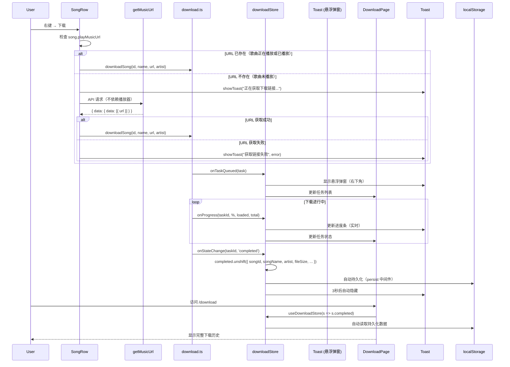

# RanNuan Music Player 桌面端开发文档

> 基于 Tauri 2.x + React 19 + Vite 8 的跨平台桌面端音乐播放器
> 与移动端共享核心业务逻辑（API、状态管理、音源解析、类型定义）

---

## 一、项目概述

### 1.1 背景

桌面端基于移动端已验证的业务逻辑，复用 `shared/` 核心包，仅重写平台相关的 UI 层和原生服务层。

### 1.2 核心原则

| 原则 | 说明 |
|------|------|
| **共享优先** | API、Store、Parser、Types、Utils 全部放入 `shared/`，多端共用 |
| **平台隔离** | `shared/` 纯 TS/JS，禁止任何平台 API |
| **UI 独立** | 移动端用 RN 组件，桌面端用 React DOM 组件 |
| **渐进式开发** | 先跑通播放链，再逐步补齐功能 |

### 1.3 技术栈

| 层级 | 技术 | 版本 |
|------|------|------|
| 框架 | Tauri | 2.11.2 |
| 前端 | React | 19.2.6 |
| 窗口管理 | Tauri Window API | v2（`LogicalSize` / `LogicalPosition`）|
| 构建 | Vite | 8.0.12 |
| 路由 | React Router | 7.17.0 |
| 状态管理 | Zustand | 5.0.14 |
| HTTP | axios | 1.17.0 |
| 样式 | Tailwind CSS | 4.3.0 |
| 图标 | Lucide React | 1.17.0 |
| 音频 | HTMLAudioElement | - |

---

## 二、项目结构

```
desktop/
├── src/
│   ├── main.tsx              ← React 应用入口（StrictMode）
│   ├── App.tsx               ← 根组件 + 主题同步
│   ├── routes.tsx            ← 路由配置（React Router v7）
│   ├── components/
│   │   ├── layout/           ← 全局布局组件
│   │   │   ├── Layout.tsx           ← 主布局骨架（侧边栏 + 主内容 + 底部播放器）
│   │   │   ├── Sidebar.tsx        ← 左侧导航栏（流光渐变 Logo + 主题切换开关 + 用户头像）
│   │   │   ├── TitleBar.tsx       ← 自定义标题栏（品牌 Logo + 版本号 + 窗口按钮）
│   │   │   ├── PlayerBar.tsx      ← 底部播放器控制栏
│   │   │   ├── PlaylistDrawer.tsx ← 播放队列抽屉
│   │   │   ├── LyricsPanel.tsx    ← 歌词弹窗面板
│   │   │   ├── FloatingLyrics.tsx ← 桌面悬浮歌词
│   │   │   ├── GlobalSearch.tsx    ← 全局搜索弹窗
│   │   │   ├── KeepAlive.tsx      ← 路由 & Tab 级缓存（页面+tab切走不销毁）
│   │   │   └── MiniPlayer.tsx     ← 迷你播放器
│   │   └── common/
│   │       ├── SongRow.tsx        ← 通用歌曲列表行（右键菜单8项：播放/下一首/收藏/歌手/专辑/详情/下载/相似/评论/删歌单/音源）
│   │       ├── ContextMenu.tsx    ← 右键菜单渲染组件
│   │       ├── DownloadProgressToast.tsx  ← 全局悬浮下载进度弹窗（自动显隐 + 实时进度 + 展开/收起）
│   │       ├── FollowListModal.tsx  ← 关注/粉丝列表弹窗（双 tab + 一键关注/取关）
│   │       ├── CommentSection.tsx     ← 全局评论组件（热门/最新双Tab+抱抱+楼层回复+举报+新评论输入）
│   │       ├── LoadMore.tsx       ← 分页加载状态组件（加载中/加载更多/已加载全部）
│   │       ├── Toast.tsx          ← Toast 通知容器
│   │       ├── StartupModals.tsx  ← 首次启动免责声明 + 捐赠弹窗
│   │       ├── DisclaimerModal.tsx ← 免责声明弹窗
│   │       ├── DonationModal.tsx  ← 捐赠二维码弹窗
│   │       └── SplashScreen.tsx   ← 启动动画（马卡龙配色 + 3D Logo + 狗狗叫声）
│   │   └── player/
│   │       └── SourceSelector.tsx  ← 音源选择弹窗（bodian/QQ/咪咕/酷狗/酷我/网易/GD 多音源切换）
│   ├── pages/                ← 页面级组件（共 19 个）
│   │   ├── HomePage.tsx      ← 首页（Banner轮播/快捷入口/推荐歌单/热门歌手/新碟上架/推荐新歌）
│   │   ├── SearchPage.tsx    ← 搜索页（防抖建议 + 热搜卡片 + 历史记录 + Ctrl+K 聚焦 + 键盘导航）
│   │   ├── PlaylistPage.tsx  ← 歌单详情（渐变头图/封面/创建者/标签/统计/歌曲列表）
│   │   ├── AlbumPage.tsx     ← 专辑详情（封面/歌手/歌曲列表）
│   │   ├── ArtistPage.tsx    ← 歌手详情（头像/热门歌曲/热门专辑）
│   │   ├── DailyRecommendPage.tsx ← 每日推荐详情（渐变头图/日期/历史日推/歌曲列表）
│   │   ├── LibraryPage.tsx   ← 音乐库（歌单广场/歌手/新碟上架/MV精选/排行榜，5 个 TabCache）
│   │   ├── FavoritesPage.tsx ← 我喜欢的音乐（收藏列表）
│   │   ├── HistoryPage.tsx   ← 最近播放（播放历史，上限200首）
│   │   ├── LocalMusicPage.tsx← 本地音乐（导入/IndexedDB持久化/封面匹配/播放本地音频文件）
│   │   ├── SettingsPage.tsx  ← 设置页（API地址/音质/快捷键说明）
│   │   ├── TopListPage.tsx   ← 排行榜页
│   │   ├── UserPage.tsx      ← 用户详情页（Hero背景/7入口快捷菜单/创建+收藏+专辑+歌手Tab）
│   │   ├── LoginPage.tsx     ← 登录页
│   │   ├── SongDetailPage.tsx← 全屏播放页（毛玻璃+黑胶唱片+歌词/评论/相似三Tab）
│   │   ├── SongCommentPage.tsx← 独立歌曲评论页（/song/:id/comments 路由）
│   │   ├── CommentHistoryPage.tsx ← 评论历史（时间线卡片+类型过滤+分页+删除+点赞）
│   │   ├── HeatmapPage.tsx   ← 听歌热力图（年度月历网格/getMusicCalendar/深浅绿色渐变）
│   │   ├── DownloadPage.tsx  ← 下载管理（Hero大图+grid列表+文件路径+打开文件夹按钮+进度弹窗）
│   │   └── PlaylistImportPage.tsx ← 歌单导入（链接/文本两种模式/importPlaylist+轮询状态）
│   ├── services/
│   │   ├── audioService.ts   ← HTMLAudioElement 播放控制（play/pause/seek/volume/rate/预加载/MediaSession/saveSession/trayTooltip）
│   │   ├── sessionManager.ts ← 会话持久化（localStorage 直写，刷新/重启后恢复播放状态）
│   │   └── shellService.ts   ← Tauri Shell 服务（打开文件夹/获取下载路径）
│   ├── hooks/
│   │   ├── usePlaybackControl.ts  ← 统一播放控制 Hook（播放/暂停/切歌/进度/速率/状态同步）
│   │   ├── useSleepTimer.ts       ← 睡眠定时器 Hook（倒计时自动停止播放）
│   │   ├── useGlobalShortcuts.ts   ← Tauri 全局媒体快捷键注册
│   │   ├── useTrayEvents.ts       ← 托盘事件监听（播放/暂停/上/下一首）
│   │   ├── useContextMenu.ts       ← 右键菜单 Hook（位置/显隐管理）
│   │   ├── usePaginatedList.ts     ← 通用分页 Hook（items/offset/hasMore/loading/loadMore/refresh）
│   │   ├── useInfiniteScroll.ts    ← 无限滚动 Hook（IntersectionObserver 自动触发 loadMore）
│   │   ├── useProgressiveRender.ts ← 渐进式渲染 Hook（初始少量 DOM，滚动追加，placeholder 保滚动条）
│   │   └── useImageColor.ts        ← 图片主色提取 Hook（canvas 像素平均值，用于动态渐变背景）
│   ├── store/
│   │   ├── authStore.ts      ← 认证状态（登录态/用户信息/头像）
│   │   ├── historyStore.ts   ← 播放历史存储（localStorage，上限200）
│   │   ├── favoritesStore.ts ← 收藏存储（localStorage，toggleFavorite/isFavorite）
│   │   └── downloadStore.ts  ← 下载管理（Zustand + persist，任务队列/并发/进度/已完成列表）
│   ├── utils/
│   │   ├── toast.ts          ← 全局 Toast 通知系统
│   │   ├── indexedDB.ts      ← IndexedDB 持久化（getCache/setCache 带TTL + storeLocalFile/loadLocalFile 文件存储）
│   │   ├── download.ts       ← 下载核心引擎（fetch blob + 并发队列 + AbortController + 进度回调）
│   │   └── image.ts          ← 图片 URL 优化（thumbUrl/avatarUrl/coverUrl/heroUrl CDN 缩放）
│   └── index.css             ← 全局样式 + Tailwind + 自定义滚动条
├── src-tauri/                ← Rust 后端
│   ├── src/
│   │   ├── main.rs           ← Tauri 主进程入口
│   │   └── lib.rs            ← 应用构建 + 系统托盘设置
│   ├── capabilities/
│   │   └── default.json      ← Tauri 权限配置（窗口控制/托盘/迷你模式）
│   ├── Cargo.toml            ← Rust 依赖（tauri + tray-icon feature）
│   └── tauri.conf.json       ← Tauri 配置（隐藏系统标题栏/最小窗口尺寸）
├── vite.config.ts            ← Vite 配置（React + @shared alias）
├── tsconfig.json
└── package.json
```

---

## 三、共享层设计（shared/）

### 3.1 设计目标

`shared/` 是一个纯 TypeScript 包，不包含任何平台相关代码。桌面端通过 Vite alias `@shared` 引用。

### 3.2 可复用模块

| 模块 | shared 路径 | 说明 |
|------|------------|------|
| API 请求层 | `shared/src/api/*.ts` | axios 拦截器 + 各模块 API（home/music/login/search/user/playlist/artist/album/comment/mv/simi/list/style/voice/advanced） |
| 类型定义 | `shared/src/types/*.ts` | SongResult、PlayerState、PlaylistState 等 |
| 音源解析 | `shared/src/services/musicParser.ts` | 多策略音源解析 |
| 工具函数 | `shared/src/utils/*.ts` | format、lyricParser、color 等 |
| 业务常量 | `shared/src/constants/*.ts` | config、storage、theme |
| Player Store | `shared/src/store/playerStore.ts` | Zustand + persist（音量/播放状态/当前歌曲/进度） |
| Playlist Store | `shared/src/store/playlistStore.ts` | Zustand + persist（播放队列/原始队列/`originalPlayList`/`consecutiveFailCount`/索引/**预打乱随机列表**/`playNextQueue` 优先队列/模式/抽屉显隐） |
| Settings Store | `shared/src/store/settingsStore.ts` | Zustand + persist（主题/语言/API地址/音质） |
| User Store | `shared/src/store/userStore.ts` | Zustand + persist（用户信息/登录态） |

### 3.3 平台独立模块

| 模块 | 桌面端实现 |
|------|-----------|
| 音频播放 | `desktop/src/services/audioService.ts`（HTMLAudioElement + Web Audio EQ + MediaSession + 预加载 + 操作锁 + URL过期检查 + 重试机制 + 错误自动切歌） |
| 播放历史 | `desktop/src/store/historyStore.ts`（Zustand + localStorage，上限200，带播放时间戳） |
| 收藏 | `desktop/src/store/favoritesStore.ts`（localStorage） |
| Toast | `desktop/src/utils/toast.ts`（全局事件通知） |
| 右键菜单 | `desktop/src/hooks/useContextMenu.ts` |
| 系统托盘 | `src-tauri/src/lib.rs`（Rust，tray-icon feature） |
| 全局快捷键 | `desktop/src/hooks/useGlobalShortcuts.ts`（Tauri Global Shortcut Plugin） |

---

## 四、已完成功能清单

### 播放器
- [x] HTMLAudioElement 音频播放（play/pause/seek/volume/rate）
- [x] 播放进度同步（`timeupdate` 事件 + `setInterval(500ms)` 双保险）
- [x] 播放结束自动切歌（`ended` 事件 → `popPlayNextQueue` → 单曲循环 → `nextPlay`）
- [x] 播放模式切换（**列表循环** / **单曲循环** / **随机**）
- [x] 随机播放：**Fisher-Yates 预打乱**，当前歌曲固定首位，保证不重复
- [x] `playNextQueue` 独立队列：右键「下一首播放」高优先级，消费后自动清除
- [x] 音频错误自动 fallback：解码失败 / URL 过期 → 自动切下一首 + Toast
- [x] 播放队列管理（添加/删除/清空/索引切换）
- [x] 播放队列抽屉（右侧滑出，点击切歌、删除）
- [x] **原始播放列表恢复**（`originalPlayList` + `restoreOriginalOrder`，随机模式切回顺序时恢复原始顺序）
- [x] **连续失败保护**（`consecutiveFailCount` + `MAX_FAILS=5`，连续播放失败超过阈值自动暂停，防止死循环）
- [x] **列表结束自动暂停**（非循环模式下播完最后一首自动暂停，不自动回到开头）
- [x] **防抖 localStorage 写入**（`pendingWrites` Map + 2s debounce，避免高频状态变更导致频繁磁盘写入）
- [x] **操作锁机制**（`acquireOperationLock` / `releaseOperationLock`，防止并发音频操作导致状态混乱）
- [x] **URL 过期检查**（播放前检测 URL 有效期，过期自动重新解析）
- [x] **批量获取歌曲详情**（`fetchSongs`，批量预加载歌曲 URL 和歌词，减少播放等待）
- [x] **歌词懒加载**（播放成功后自动预加载歌词到 `song.lyric`，避免播放时阻塞）
- [x] **重试机制**（播放失败后自动重试，最多 3 次）
- [x] **统一播放控制 Hook**（`usePlaybackControl`，封装 play/pause/seek/toggle/next/prev/rate 等常用操作）
- [x] **播放历史集成**（Zustand 响应式 store，播放成功自动记录，带时间戳，上限 200 首）
- [x] **播放速率控制 UI**（PlayerBar 速率按钮，支持 0.5x / 0.75x / 1x / 1.25x / 1.5x / 2x）
- [x] **睡眠定时器**（`useSleepTimer`，倒计时结束后自动暂停播放）
- [x] **会话持久化与恢复**（`sessionManager`，刷新/重启后 PlayBar 恢复上次歌曲 + 保持暂停状态，点击播放即可继续）
- [x] **系统托盘播放控制**（右键菜单：播放/暂停 + 上/下一首 + 实时歌曲 tooltip + 关闭→托盘）
- [x] **启动动画**（3s Splash Screen，马卡龙流体背景 + 3D Logo 浮动 + 狗狗叫声）

### 首页（HomePage）
- [x] Banner 轮播（自动5秒切换 / 左右箭头 / 指示器圆点 / 点击跳转）
- [x] 快捷入口卡片（3x2 网格，真实封面背景 + 渐变遮罩 + 图标）
- [x] 快捷入口：推荐新歌 / 每日推荐 / 私人FM / 排行榜 / MV精选 / 歌单广场
- [x] 每日推荐入口跳转详情页 `/daily-recommend`
- [x] 私人FM 并行获取4次，累积约12首歌曲
- [x] 推荐歌单（5列网格，底部渐变 + 播放量角标 + 右下角hover播放按钮）
- [x] 热门歌手（横向滚动，圆形头像 + hover放大 + 绿色环）
- [x] 新碟上架（横向滚动，`getNewAlbum` API，CD侧面装饰 + 底部渐变 + hover播放按钮）
- [x] 推荐新歌（排名编号/前3名红色/分隔线/20首/hover播放按钮）
- [x] 并行数据获取（`Promise.allSettled`）+ loading 状态 + error 重试

### 搜索页（SearchPage）
- [x] 搜索框（圆角阴影 + 聚焦ring + 搜索建议下拉）
- [x] 分类标签（歌曲/歌手/专辑/歌单，底部下划线指示器）
- [x] 歌曲结果（排名编号 + 封面 + 歌手 + 专辑 + 时长 + hover播放）
- [x] 歌手结果（圆形头像卡片，hover放大）
- [x] 专辑/歌单结果（卡片化，hover scale-110 + 播放按钮浮现 + 阴影上移）
- [x] 歌单播放量角标（Headphones + backdrop-blur）

### 歌单详情页（PlaylistPage）
- [x] 渐变头图背景（`from-[#e60026]/10`）
- [x] 大封面 + 阴影
- [x] 创建者信息（头像 + 昵称 + 创建时间）
- [x] 歌单描述、标签 pill 展示
- [x] 统计数据（歌曲数/播放量/收藏数/更新时间）
- [x] 歌曲列表（排名编号/前3名红色/封面/歌手/时长/hover播放按钮）
- [x] **性能优化**：`getPlaylistTrackAll({ limit: 9999 })` 一次拿全量（不再 limit=50 分页），362 首歌秒加载
- [x] **播放全部**：直接使用全量数据，无 50 首截断限制

### 每日推荐页（DailyRecommendPage）
- [x] 渐变头图 + 大封面 + 日期角标
- [x] 播放全部按钮
- [x] 历史日推展开面板（日期chip选择器）
- [x] 歌曲列表（排名编号/hover播放/右键菜单/三点菜单）

### UI 布局
- [x] 自定义标题栏（隐藏系统标题栏，最小化/最大化/关闭 + 自定义 Logo）
- [x] 左侧导航栏（首页/搜索/排行榜/音乐库/我喜欢/最近播放/本地音乐/下载管理/设置 + 自定义 Logo + 用户/主题切换 + 深色模式 class 策略修复）
- [x] 底部播放器栏（歌曲信息/控制/拖拽进度条/hover时间预览/滚轮音量/静音切换/队列按钮/歌词按钮/音源切换/迷你模式/播放速率/收藏）
- [x] 迷你播放器模式（Tauri 窗口缩放，360×72，窗口置顶，不可调整大小，点击恢复全窗口）
- [x] 迷你播放器收藏/取消收藏（实时同步，Toast 反馈）
- [x] 迷你播放器音量控制（滚轮/滑块/静音切换）
- [x] 迷你播放器可点击进度条（点击跳转 + 悬停时间预览）
- [x] 迷你播放器播放列表展开（点击展开/收起，列表项切歌/删除）
- [x] 播放列表展开时窗口动态变高（360×400）
- [x] 歌曲详情页（点击底部播放器进入）

### 歌词
- [x] 歌词弹窗面板（`Ctrl+L`，逐行高亮 + 自动滚动居中）
- [x] 桌面悬浮歌词（`Ctrl+D`，可拖拽，透明背景，逐行高亮）

### 搜索与导航
- [x] 搜索页（关键词搜索 + 搜索建议）
- [x] 全局搜索弹窗（`Ctrl+Shift+S`，覆盖全屏的搜索面板）
- [x] 歌手详情页（`/artist/:id`）
- [x] 专辑详情页（`/album/:id`）
- [x] 歌曲列表中点击歌手名跳转歌手页

### 数据管理
- [x] 播放历史（localStorage，上限 200 首，自动记录）
- [x] 收藏功能（localStorage，右键菜单收藏/取消收藏）
- [x] 本地音乐导入（`<input type="file" accept="audio/*" multiple>`）
- [x] 本地音乐持久化（**IndexedDB** 存储音频 ArrayBuffer，刷新不丢失；数据丢失检测 + 警告）
- [x] 本地音乐封面匹配（文件名解析 → `getSearch` 网易云搜索 → `thumbUrl` 封面）
- [x] 歌单页「播放全部」按钮

### 交互
- [x] 歌曲右键菜单（播放/下一首播放/收藏/歌手/专辑/下载）
- [x] 歌曲三点菜单（`MoreHorizontal` 按钮，hover 浮现，与右键菜单共用同一套菜单项）
- [x] SongRow hover 操作（下一首播放按钮 + 收藏按钮 + 三点菜单按钮）
- [x] Toast 通知（播放开始/收藏/下载等操作反馈）
- [x] 自定义滚动条样式（light/dark 模式适配）
- [x] 横向滚动区域隐藏滚动条（`.scrollbar-hide` CSS 工具类）

### 系统级
- [x] 系统托盘图标（左键恢复窗口，**右键完整菜单**：播放/暂停 + 上/下一首 + 显示/退出）
- [x] 托盘 tooltip 实时显示当前歌曲（`🎵 歌曲名 — 歌手名`）
- [x] 关闭按钮 → 最小化到托盘（类似 QQ音乐/网易云行为）
- [x] 全局媒体快捷键（Tauri Global Shortcut Plugin，播放/暂停/下一首/上一首）
- [x] 空格键播放/暂停（排除输入框）
- [x] 深色/浅色模式切换（Sidebar 底部 iOS 风格 toggle + 系统主题同步）
- [x] 窗口控制权限配置（设置大小/位置/置顶/可调整大小/最小最大尺寸限制）
- [x] **Tauri 原生打开下载文件夹**（Rust open_downloads_folder 命令）
- [x] **启动动画**（Splash Screen：马卡龙流体背景 + 3D Logo + 狗狗叫声）

### 用户中心（UserPage 快捷菜单）
- [x] 7 入口快捷菜单全部接入后端路由（收藏/历史/评论/本地/热力图/下载/导入）
- [x] 评论历史页（时间线卡片 + `threadId` 解析 + `getMusicDetail` 批量补全歌曲信息）
- [x] 听歌热力图页（年度月历网格，绿色深浅渐变，year 切换器）
- [x] **下载管理页**（fetch blob 流式下载 + Zustand 任务队列 + 并发控制 + 悬浮进度弹窗 + Hero大图 + grid列表 + 打开下载文件夹 + 删除单条/清空）
- [x] 歌单导入页（链接/文本导入，轮询任务状态）

### 设置
- [x] 设置页面（API 基础地址/默认音质/快捷键说明）

---

## 五、快捷键汇总

| 快捷键 | 功能 |
|--------|------|
| `Space` | 播放 / 暂停（输入框内除外） |
| `Ctrl + L` | 显示 / 隐藏歌词面板 |
| `Ctrl + D` | 显示 / 隐藏桌面悬浮歌词 |
| `Ctrl + K` | 聚焦搜索框（搜索页） |
| `Ctrl + Shift + S` | 打开全局搜索弹窗 |
| `Esc` | 关闭弹窗/抽屉 |
| 点击播放器底部迷你按钮 | 进入迷你模式（窗口缩小到 360×72） |
| 迷你模式下点击恢复按钮 | 退出迷你模式（窗口恢复原始尺寸） |
| 媒体键 ▶️⏸️ | 播放 / 暂停（系统级） |
| 媒体键 ⏭️ | 下一首（系统级） |
| 媒体键 ⏮️ | 上一首（系统级） |

---

## 六、页面路由

| 路由 | 页面 | 说明 |
|------|------|------|
| `/` | HomePage | 首页（Banner轮播/快捷入口/推荐歌单/热门歌手/新碟上架/推荐新歌） |
| `/search` | SearchPage | 搜索页（关键词 + 建议 + 分类标签 + 卡片化结果） |
| `/playlist/:id` | PlaylistPage | 歌单详情（渐变头图/封面/创建者/标签/统计/歌曲列表） |
| `/album/:id` | AlbumPage | 专辑详情 |
| `/artist/:id` | ArtistPage | 歌手详情（头像/热门歌曲/热门专辑） |
| `/daily-recommend` | DailyRecommendPage | 每日推荐详情（渐变头图/日期/历史日推/歌曲列表） |
| `/library` | LibraryPage | 音乐库（推荐音乐） |
| `/favorites` | FavoritesPage | 我喜欢的音乐（收藏列表） |
| `/history` | HistoryPage | 最近播放（播放历史） |
| `/local` | LocalMusicPage | 本地音乐（导入/IndexedDB持久化/封面匹配） |
| `/settings` | SettingsPage | 设置（API/音质/快捷键） |
| `/toplist` | TopListPage | 排行榜页 |
| `/user/:id` | UserPage | 用户详情页（Hero背景/7入口快捷菜单/Tab内容） |
| `/login` | LoginPage | 登录页 |
| `/song/:id` | SongDetailPage | 歌曲详情页（大封面/播放控制） |
| `/comment-history` | CommentHistoryPage | 评论历史（时间线卡片/getUserCommentHistory） |
| `/heatmap` | HeatmapPage | 听歌热力图（月历网格/getMusicCalendar） |
| `/download` | DownloadPage | 下载管理（localStorage任务列表） |
| `/playlist-import` | PlaylistImportPage | 歌单导入（链接/文本/importPlaylist） |

---

## 七、开发命令

```bash
# 进入桌面端目录
cd desktop

# 启动 Tauri 开发模式（前端 Vite + Rust 后端）
npx tauri dev

# 仅启动前端开发服务器
npm run dev

# 构建前端生产包
npm run build

# 构建桌面端应用（当前平台）
npx tauri build
```

### Rust 编译前提

```powershell
# Windows 下确保 cargo 在 PATH 中
$env:Path += ";C:\Users\<用户名>\.cargo\bin"
```

---

## 八、常见问题

**Q: `shared` 包找不到模块？**  
A: `shared` 不是 npm 包，而是通过 Vite alias 解析：
```ts
// vite.config.ts
resolve: {
  alias: {
    '@shared': path.resolve(__dirname, '../shared/src'),
  },
}
```

**Q: Tauri 的 `tray-icon` feature 编译报错？**  
A: `Cargo.toml` 中需添加 `tauri = { version = "2.x", features = ["tray-icon"] }`，并在 `lib.rs` 顶部添加 `use tauri::Manager;`。

**Q: 右键菜单触发后无法自动关闭？**  
A: `useContextMenu` Hook 已在 `window` 上注册了 `click` 和 `scroll` 事件监听器来自动隐藏菜单。

**Q: 如何新增页面？**  
A: 1. 在 `src/pages/` 创建页面组件；2. 在 `src/routes.tsx` 添加 `<Route>`（保留备用）；3. 在 `src/components/layout/KeepAlive.tsx` 添加 lazy import + 缓存/动态路由配置（实际生效的路由）；4. 在 `src/components/layout/Sidebar.tsx` 添加 `NavLink`（如需要导航入口）。

**Q: 随机播放时为什么不会连续重复同一首歌？**  
A: 切换到随机模式时，`playlistStore` 会使用 Fisher-Yates 算法预生成打乱索引列表 `__shuffledIndices`，并将当前歌曲固定为列表第 1 个。`nextPlay` 和 `prevPlay` 按此列表顺序移动，而非每次重新 `Math.random()`。

**Q: 为什么「下一首播放」的歌曲有时不在播放队列里？**  
A: 「下一首播放」使用独立的 `playNextQueue` 队列。当一首歌播放结束时，会先消费 `playNextQueue`，再从主列表切歌。这样避免了临时插入的歌曲打乱原有播放列表的顺序。

**Q: 播放模式 0/1/2 分别是什么？**  
A: `0` = 列表循环（播完最后一首回到第一首）；`1` = 单曲循环（onend 重播当前歌曲）；`2` = 随机播放（按预打乱顺序遍历）。

**Q: 播放失败会自动切歌吗？**  
A: 会，但有保护机制。`audioService` 在以下场景都会自动 `nextPlay` + `playSong`：
1. `audio` `error` 事件（解码失败、格式不支持、网络中断）
2. `parseMusicUrl` 返回空 URL
3. `play()` 抛异常（网络/解析错误）

同时引入了 **连续失败保护**：`playlistStore` 维护 `consecutiveFailCount`，连续失败超过 `MAX_FAILS=5` 次时自动暂停播放并 Toast 提示，防止无限死循环切歌。播放成功时自动重置失败计数。

---

## 九、首页 & 歌手页性能优化（v3.0）

借鉴 AlgerMusicPlayer（Vue3 + Electron）的性能优化策略，对桌面端两大卡顿页面进行了系统性重构。

### 核心问题诊断

| 页面 | 卡顿原因 | 影响 |
|------|---------|------|
| **首页** | `loadData` 用 `useCallback` 绑定所有 state 作为依赖项 → 每次 setState → loadData 引用变化 → useEffect 重新执行 → 无限循环请求 API | `ERR_INSUFFICIENT_RESOURCES`（浏览器连接耗尽）+ 疯狂闪屏 |
| **首页** | Banner 轮播 `setInterval` 依赖 `banners.length` → 每次 API 返回后 interval 被重置 | 定时器抖动 |
| **首页** | 推荐新音乐一次性渲染 20 首 SongRow | 首屏 DOM 节点过多 |
| **歌手页** | SongRow 内部调用 `useNavigate()` + `usePlaylistStore()` + `isFavorite()` + `useMemo` 菜单项 | 50 首歌 = 50 个 hook + 50 个 store 订阅，全局状态变化时全部重渲染 |
| **歌手页** | 封面大图 + 相似歌手图片无懒加载 | 首屏加载大量图片 |
| **歌手页** | "全部歌曲" 分页后一次性渲染所有 DOM | 即使分页只加载 50 首，也一次性创建 50 个 SongRow DOM |

### 优化方案

#### 1. SongRow 纯组件化（最大收益）

**思路来源**：移动端 `SongItem` 是纯展示组件，零 hook、零全局状态订阅。

**改造前**（每个 SongRow 内部）：
- `useNavigate()` — React Router hook
- `usePlaylistStore()` — Zustand store 订阅
- `isFavorite(song.id)` — 收藏状态检查
- `useMemo(() => [...], [song, fav, onPlay, addToNextPlay, navigate])` — 菜单项缓存
- hover 按钮内联 `addToNextPlay(song)` / `toggleFavorite(song)`

**改造后**（纯展示组件）：
```tsx
// 零 hook，所有操作通过 props 委托给父组件
interface SongRowProps {
  song: SongResult
  index: number
  isFavorite?: boolean        // 纯 prop，不内部读取 store
  onPlay?: () => void
  onAddToNext?: () => void   // 父组件提供回调
  onToggleFavorite?: () => void
  onMore?: (e: React.MouseEvent) => void
}
```

**memo 比较函数忽略所有回调引用变化**：
```tsx
(prev, next) => {
  return prev.song.id === next.song.id
    && prev.index === next.index
    && prev.isFavorite === next.isFavorite
  // 不比较 onPlay/onAddToNext/onToggleFavorite/onMore！
}
```

**涉及文件**：
- `desktop/src/components/common/SongRow.tsx` — 纯组件化重写
- `desktop/src/pages/ArtistPage.tsx` — 父组件提供 `handleAddToNext`, `handleToggleFav`, `onMore` 菜单构建
- `desktop/src/pages/PlaylistPage.tsx` — 更新 SongRow 调用方式
- `desktop/src/pages/HomePage.tsx` — 更新 SongRow 调用方式
- `desktop/src/pages/DailyRecommendPage.tsx` — 更新 SongRow 调用方式
- `desktop/src/pages/LibraryPage.tsx` — 更新 SongRow 调用方式
- `desktop/src/pages/FavoritesPage.tsx` — 更新 SongRow 调用方式
- `desktop/src/pages/HistoryPage.tsx` — 更新 SongRow 调用方式
- `desktop/src/pages/AlbumPage.tsx` — 更新 SongRow 调用方式
- `desktop/src/pages/SongDetailPage.tsx` — 更新 SongRow 调用方式
- `desktop/src/components/layout/GlobalSearch.tsx` — 更新 SongRow 调用方式

#### 2. 渐进式渲染（借鉴 AlgerMusicPlayer `useProgressiveRender`）

**原理**：初始只渲染少量 DOM 节点（默认 20 个），滚动到底部哨兵时通过 `IntersectionObserver` 逐步追加，同时用 `placeholderHeight` 保持滚动条总长度，避免跳动。

**新文件**：
- `desktop/src/hooks/useProgressiveRender.ts`

**已集成**：
- `ArtistPage` "全部歌曲" tab：50 首分页数据 → 初始只渲染 20 个 DOM 节点 → 滚动追加 20 个 → 依此类推

#### 3. IndexedDB 本地缓存（借鉴 AlgerMusicPlayer `IndexDBHook`）

**原理**：进入页面先读本地缓存快速展示，同时后台发起 API 刷新，成功后更新缓存。缓存带 TTL（默认 5 分钟）。

**新文件**：
- `desktop/src/utils/indexedDB.ts` — `getCache<T>(store, key)`, `setCache<T>(store, key, data, ttlMinutes)`

**已集成**：
- `HomePage`：缓存 banners、playlists、songs、hotSingers、newAlbums、dailySongs、covers
- `ArtistPage`：缓存 artist、hotSongs、desc、similarArtists、followed

#### 4. 图片预提取主题色（借鉴 AlgerMusicPlayer `useSongItem` 的 `handleImageLoad`）

**原理**：把图片画到 10×10 canvas 上，取所有像素平均值（过滤白色），返回 `primaryColor`。

**新文件**：
- `desktop/src/hooks/useImageColor.ts`

**已集成**：
- `ArtistPage` cover hero 的渐变遮罩基于提取的主色，不再是固定的黑色渐变：
  ```tsx
  background: linear-gradient(to top, rgba(0,0,0,0.75), rgba(0,0,0,0.4), ${primaryColor}33)
  ```

#### 5. 首页其他优化

| 优化项 | 说明 |
|--------|------|
| Banner 轮播定时器 | 用 `useRef` 存储 banners 数组，interval 只设置一次，不再因 banners 更新而重置 |
| 图片懒加载 | 所有 `` 添加 `loading="lazy" decoding="async"`，Banner 首张用 `loading="eager"` |
| 推荐新音乐截断 | 默认显示 10 首 + "查看全部"展开按钮（之前 20 首） |
| 热门歌曲截断 | 默认显示 20 首 + 展开按钮 |
| loadData 修复 | 改为普通 async 函数（不用 `useCallback`），避免 state 依赖导致的无限循环 |

### 关键设计决策

1. **SongRow 纯组件化**：所有全局状态读取和副作用操作必须提升到父组件。子组件只接收纯数据和回调，这样 `memo` 才能有效工作。
2. **回调引用不比较**：`memo` 的比较函数忽略 `onPlay`/`onAddToNext` 等回调的引用变化。父组件每次渲染都会创建新的回调，但子组件不会因为回调变化而重渲染。
3. **渐进式渲染 vs 虚拟滚动**：渐进式渲染比虚拟滚动实现简单（不用精确计算每个 item 的位置），性能提升足够明显。
4. **缓存写入时机**：`setCache` 放在 `loadData` 的 `finally` 中，用 `setTimeout(..., 0)` 延迟写入，确保 state 已更新。

---

## 十、播放模块优化总结（v2.0）

本次迭代对桌面端播放核心进行了系统性优化，参考 AlgerMusicPlayer 的 playbackController 设计，重点解决稳定性、性能和用户体验问题。

### 核心改进

| 优先级 | 功能 | 涉及文件 | 说明 |
|--------|------|---------|------|
| P0 | 原始播放列表恢复 | `shared/src/store/playlistStore.ts` | 新增 `originalPlayList` 字段和 `restoreOriginalOrder`，随机模式切回顺序时恢复原始列表顺序 |
| P0 | 连续失败保护 | `shared/src/store/playlistStore.ts` | 新增 `consecutiveFailCount` + `MAX_FAILS=5`，超过阈值自动暂停，防止死循环 |
| P0 | 列表结束自动暂停 | `shared/src/store/playlistStore.ts` | `nextPlay` 支持 `autoEnd` 参数，非循环模式播完最后一首自动暂停 |
| P0 | 防抖 localStorage 写入 | `desktop/src/adapters/localStorageAdapter.ts` | `pendingWrites` Map + 2s debounce，避免高频状态变更导致频繁磁盘写入 |
| P0 | 操作锁机制 | `desktop/src/services/audioService.ts` | `acquireOperationLock` / `releaseOperationLock`，防止并发音频操作导致竞态条件 |
| P0 | URL 过期检查 | `desktop/src/services/audioService.ts` | 播放前检测 URL 有效期，过期自动重新解析音源 |
| P1 | 批量获取歌曲详情 | `desktop/src/services/audioService.ts` | `fetchSongs` 批量预加载歌曲 URL 和歌词，减少播放等待时间 |
| P1 | 改进预加载逻辑 | `desktop/src/services/audioService.ts` | 根据播放模式正确计算 `nextIndex`（随机模式用预打乱索引，顺序模式用下一首） |
| P1 | 重试机制 | `desktop/src/services/audioService.ts` | 播放失败后自动重试，最多 3 次，提升弱网环境下的播放成功率 |
| P1 | 歌词懒加载 | `desktop/src/services/audioService.ts` | 播放成功后自动预加载歌词到 `song.lyric` 字段，避免播放时阻塞 |
| P1 | 统一播放控制 Hook | `desktop/src/hooks/usePlaybackControl.ts` | 封装 play/pause/seek/toggle/next/prev/setRate 等常用操作，UI 层统一调用 |
| P1 | 播放历史集成 | `desktop/src/store/historyStore.ts` | Zustand 响应式 store，播放成功自动记录，带时间戳，上限 200 首，支持去重 |
| P2 | 播放速率控制 UI | `desktop/src/components/layout/PlayerBar.tsx` | PlayerBar 添加速率按钮，支持 0.5x / 0.75x / 1x / 1.25x / 1.5x / 2x |
| P2 | 睡眠定时器 | `desktop/src/hooks/useSleepTimer.ts` | 倒计时结束后自动暂停播放，支持分钟级设置 |

### 关键设计决策

1. **代际计数器（Generation Counter）**：`audioService` 使用 `playGeneration` 防止快速切歌时的竞态条件，过时请求会被静默丢弃。
2. **预加载缓存**：`preloadedNext` 缓存下一首歌曲的 URL，实现无缝切换。
3. **共享层与平台层边界**：所有播放逻辑状态（`originalPlayList`、`consecutiveFailCount`、`playMode`、`playListIndex`）存放在 `shared/src/store/playlistStore.ts`，平台相关的音频操作（HTMLAudioElement 控制、操作锁、URL 检查）放在 `desktop/src/services/audioService.ts`。
4. **存储适配器抽象**：`localStorageAdapter` 实现 `StorageAdapter` 接口，`setItem` 采用防抖策略，减少高频写入对磁盘/SSD 的损耗。

---

## 十一、全局性能优化 & UX 升级（v4.0）

> 借鉴 AlgerMusicPlayer 的 `content-visibility` / 图片CDN缩放 / keep-alive 等优化策略，系统性解决桌面端所有已知卡顿问题。

### 11.1 图片性能优化

| 优化项 | 文件 | 说明 |
|--------|------|------|
| **图片多级缩放** | `utils/image.ts` | `thumbUrl(100px)` / `avatarUrl(200px)` / `coverUrl(500px)` / `heroUrl(800px)` 四个级别，CDN 服务端缩放 |
| **Hero 大图修复** | `ArtistPage.tsx` | `loading="eager"` → `"lazy"`；原图 URL → `heroUrl()` 缩放到 800px；`transform: translateZ(0)` GPU 加速层 |
| **相似歌手头像** | `ArtistPage.tsx` | 原图 → `avatarUrl()`，带宽减少 ~90% |
| **专辑/MV hover** | `ArtistPage.tsx` | `duration-500` → `duration-200`，减少滚动重绘冲突 |
| **useImageColor 重写** | `hooks/useImageColor.ts` | `new Image()` 双重下载 → `fetch + createImageBitmap` + AbortController 防竞态 |
| **favoritesStore 内存缓存** | `store/favoritesStore.ts` | `isFavorite` 从 O(n) localStorage 查询 → O(1) Set 哈希；写入 2s 防抖；`beforeunload` 刷写 |

### 11.2 `content-visibility: auto` — Web 端的 GPU 裁剪

| CSS 类 | 用途 | 效果 |
|--------|------|------|
| `.song-row-item` | 歌曲列表行 | 浏览器自动跳过屏幕外渲染，300 首歌只有 ~20 行真正渲染 |
| `.grid-card-item` | 网格卡片 | 歌单/专辑/MV 网格自动裁剪 |
| `.artist-grid-card` | 歌手网格项 | 6 列歌手网格仅渲染可见行 |

### 11.3 全局 KeepAlive 路由缓存

借鉴 AlgerMusicPlayer 的 Vue `<keep-alive>`，实现 React 版两层缓存：

| 层级 | 组件 | 说明 |
|------|------|------|
| **页面级** | `CachedSlot`（`KeepAlive.tsx`） | 14 个缓存页面首次访问后永不销毁，切走 `display:none`，回来 `display:block`。二次进入 0ms 显示 |
| **Tab 级** | `TabCache`（`KeepAlive.tsx`） | LibraryPage 5 个 tab、ArtistPage 4 个 tab、UserPage 4 个 tab。切 tab 不销毁子组件，分页/滚动位置/已加载数据全保留 |

**关键改动**：
- `App.tsx`：`<AppRoutes />` → `<KeepAliveRoutes />`
- `routes.tsx`：不再被引用（保留备用）
- `useIsActive()` hook 导出，子组件可感知当前是否可见

### 11.4 SongRow 全局操作按钮

三个按钮不再依赖父组件传回调，SongRow 自给自足：

| 按钮 | 图标 | 行为 |
|------|------|------|
| 下一首播放 | `<svg>` 列表+加号 | 全局 `addToNextPlay()` + toast 提示 |
| 收藏 | `<svg>` 心形（fill/nofill） | 全局 `toggleFavorite()` + toast；`isFavorite` prop 可选传入 |
| 更多 | `<svg>` 三点 | 默认右键菜单（播放/下一首/收藏/歌手/专辑/下载） |

受影响的 7 个页面（HomePage / PlaylistPage / AlbumPage / DailyRecommend / Favorites / History / SongDetail）**零代码改动**自动生效。

### 11.5 搜索功能升级

| 功能 | 说明 |
|------|------|
| **300ms 防抖建议** | 输入后 300ms 才请求 `getSearchSuggestions`，减少无效 API 调用 |
| **热搜关键词** | 加载时 `getHotSearch()`，前 6 名卡片网格展示（金银铜排名徽章 + 趋势标签） |
| **搜索历史** | localStorage 存储，最多 20 条，支持单条删除和全部清空 |
| **Ctrl+K 全局聚焦** | 任何页面按 `Ctrl+K` 自动聚焦搜索框 |
| **键盘导航** | ↑↓ 导航建议列表，Enter 选中，Escape 关闭 |
| **首页搜索框** | "搜索音乐"按钮 → 内联输入框 + `Ctrl+K` hint badge |

### 11.6 首页导航链接修正

| 入口 | 之前 | 之后 |
|------|------|------|
| MV 精选卡片 | `/search` | `/library?tab=mv` |
| 热门歌手"查看更多" | `/search` | `/library?tab=artist` |
| 新碟上架"查看更多" | `/library` | `/library?tab=album` |
| 歌单广场卡片 | `/library` | `/library`（默认 playlist） |
| Banner MV 类型 | `/search` | `/library?tab=mv` |

### 11.7 LibraryPage URL 数据源优化

**问题**：KeepAlive 下 `useState` 只初始化一次，URL query param 改变时 tab 状态不跟随。

**修复**：`useState(tab)` + 双向 sync effect → URL 直接派生：
```ts
const tab = (searchParams.get('tab') as LibraryTab) || 'playlist'
const setTab = useCallback((key) => setSearchParams({ tab: key }), [])
```
URL 是唯一真相源，零 sync effect，零竞态。

### 11.8 更新快捷入口链接

| 入口 | 之前 | 之后 |
|------|------|------|
| MV 精选 | `/search` | `/library?tab=mv` |
| 热门歌手 | `/search` | `/library?tab=artist` |
| Banner MV | `/search` | `/library?tab=mv` |

### 11.9 其他优化

| 优化项 | 说明 |
|--------|------|
| **移除 StrictMode** | `main.tsx` 不再包裹 `<StrictMode>`，避免开发模式双重渲染 |
| **SongRow SVG 恢复** | 三个按钮的 Unicode 字符恢复为完整 inline SVG（心形/列表加号/三点），带 hover 背景和 transition |
| **封面图优化** | 所有网格卡片图片使用 `coverUrl()` 缩放 |
| **LibraryPage 拆分重构** | 5 个 tab 拆为独立子组件 + `useCallback` 稳定 fetcher + 双 observer 合并（渐进渲染完才启用分页加载）+ 筛选切换不 reset |

---

## 十二、v4.3 更新 — UserPage 接入 & 本地音乐持久化

### 12.1 UserPage 快捷菜单全部接入后端

UserPage 的 7 个快捷入口原先有 4 个 `to: null`，v4.3 全部补齐：

| 入口 | 路由 | 新页面 | 后端 API |
|------|------|--------|----------|
| 评论历史 | `/comment-history` | CommentHistoryPage | `getUserCommentHistory` + `getMusicDetail` 批量补全 |
| 听歌热力图 | `/heatmap` | HeatmapPage | `getMusicCalendar(start, end)` |
| 下载管理 | `/download` | DownloadPage | localStorage 本地任务管理 |
| 歌单导入 | `/playlist-import` | PlaylistImportPage | `importPlaylist` + `getImportTaskStatus` 轮询 |

### 12.2 评论历史页设计

- **数据解析**：三层降级 — ①嵌入 `c.song`/`c.playlist`/`c.album` ②`threadId` 解析（`R_SO_4_<id>`→歌曲等）③`getMusicDetail(ids)` 批量补全歌名/封面/歌手
- **UI 设计**：时间线左侧圆点 + 连接线，资源类型卡片头（歌曲红/歌单琥珀/专辑青），封面缩略图，hover 播放按钮，`timeAgo` 相对时间，心形可点动画
- **统计栏**：条评论/获赞/歌曲/歌单/专辑 5 项统计，品牌色独立图标

### 12.3 本地音乐 IndexedDB 持久化

**问题**：`URL.createObjectURL(file)` 创建的 blob URL 仅在当前浏览器会话有效，存 localStorage 后刷新即失效 → `ERR_FILE_NOT_FOUND`。

**方案**：

| 组件 | 说明 |
|------|------|
| `indexedDB.ts` | DB_VERSION → 2，新增 `localfiles` store + `storeLocalFile`/`loadLocalFile`/`removeLocalFile` |
| `LocalMusicPage` | 上传时 `file.arrayBuffer()` → `storeLocalFile(id, buf)` 写入 IndexedDB；加载时 `loadLocalFile(id)` → `new Blob([buf])` → 重建 blob URL |
| 数据丢失保护 | IndexedDB 清理后行显示红色警示 + "(数据丢失)"标记 + 顶部黄色警告条 |

### 12.4 本地音乐封面匹配

上传后自动调用 `getSearch` 搜索网易云曲库匹配封面和元数据：

| 步骤 | 说明 |
|------|------|
| 文件名清洗 | `cleanFilename()` 去除 `(320kbps)`/`[www.xxx.com]`/`01.` 等噪音 |
| 多策略搜索 | 依次尝试 `歌名 歌手` → `歌手 歌名` → `歌名` → 取最优结果 |
| 模糊匹配 | `exact` 比较时忽略括号内内容 |
| 批量匹配按钮 | 顶部「匹配封面(N)」批量补全全部未匹配歌曲，每批 3 并发 |
| 单曲重试 | 每行 hover 浮现刷新按钮，可单独重试匹配 |

### 11.10 图片 URL 全链优化（v4.1）

统一引入 `utils/image.ts`（`thumbUrl` / `avatarUrl` / `coverUrl` / `heroUrl`），全项目 29 处图片引用全部规范化：

| 函数 | CDN 尺寸 | 适用场景 |
|------|---------|---------|
| `thumbUrl()` | 100×100 | SongRow、迷你播放器、评论头像（≤44px 容器） |
| `avatarUrl()` | 200×200 | 歌手/用户头像（64-80px 容器） |
| `coverUrl()` | 500×500 | 歌单/专辑/Banner 封面（150-450px 容器） |
| `heroUrl()` | 800×800 | 英雄区大图 |

**涉及文件**：HomePage(4)、UserPage(5)、SearchPage(4)、PlaylistPage(2)、SongDetailPage(2)、MiniPlayer(2)、AlbumPage(1)、TopListPage(1)、Sidebar(1)、DailyRecommendPage(1)、PlayerBar(1)、SongRow(1)、PlaylistDrawer(1)、ArtistPage(4，v4.0 已完成)

### 11.11 播放队列重构（v4.1）

| 优化项 | 说明 |
|--------|------|
| **合并列表** | `playNextQueue` 暂存在 store 中，`PlaylistDrawer` 渲染时插入 `playList` 当前位置之后，视觉上是一个完整列表，[下一首] 标签标识 |
| **nextPlay 消费队列** | `nextPlay()` 内部优先 `popPlayNextQueue()`，手动切歌和自动切歌统一逻辑 |
| **UI 升级** | 遮罩层、Escape 关闭、自动滚动到当前、清空按钮、虚线分隔、红色标签徽章 |
| **图片降级** | 卡片图片使用 `song.picUrl → al?.picUrl → album?.picUrl` 三级降级链 |

### 11.12 SongRow 收藏状态即时反馈

| 问题 | 修复 |
|------|------|
| 点击收藏后图标不变化 | `fav` 从普通变量改为 `useState`，`handleToggleFav` 中 `setFav(added)` 即时更新 |
| 外部 prop 同步 | `useEffect` 监听 `isFavoriteProp` 变化并同步到本地 state |

### 11.13 右键菜单交互优化

| 优化项 | 说明 |
|--------|------|
| **点击外部一次关闭** | `window.mousedown` 替代 `window.click`，避免与按钮 click 冲突 |
| **菜单内点击不关闭** | `closest('[data-context-menu]')` 检测 |
| **行高亮持久化** | 菜单打开时 `menuOpen` state → 行保持 `bg-gray-100 + ring-[#e60026]/20`，`onClose` 回调自动清除 |
| **右键菜单** | `onContextMenu` → `e.preventDefault()` 阻止浏览器菜单 → 显示自定义菜单 |
| **菜单图标** | Unicode → Lucide 图标（`Play`/`ListPlus`/`Heart`/`MoreHorizontal`/`User`/`DiscAlbum`/`Download`/`Info`） |

### 11.14 UserPage 重设计（v4.2）

| 优化项 | 说明 |
|--------|------|
| **主题适配** | 硬编码暗色（`bg-gray-950 / text-white`）→ 自适应浅/暗色（`bg-white dark:bg-gray-900 / text-gray-900 dark:text-white`），与全站一致 |
| **品牌色统一** | 琥珀色（`amber-500`）→ 品牌红（`#e60026`），卡片/环/圆全部统一 |
| **Hero 布局** | 深黑 mesh 渐变背景 → 简洁白色 Header（头像 + 昵称 + 签名 + 四栏统计），融入主内容区 |
| **Tab 导航** | 毛玻璃 `backdrop-blur` + 暗底 → 白/灰底分段按钮，`sticky` 吸附 |
| **骨架屏** | `bg-white/[0.04]` → `bg-gray-200 dark:bg-gray-700`，与全站一致 |
| **空状态** | `text-gray-600` → `text-gray-400 dark:text-gray-500` |
| **卡片动画** | `duration-500 scale-110` → `duration-500 scale-105`，更克制；播放按钮 `translate-y-2` 弹出 |
| **Profile 加载** | `Promise.all([getUserDetail(uid), getUserSubcount()])` — 同时获取详情+统计 |
| **API 参数修复** | `getUserDetail({ uid })`（对象）→ `getUserDetail(uid)`（数字），函数签名匹配 |
| **响应解析修复** | `res?.data?.data?.profile` 五级路径 → `detail?.profile || detail` 两级降级（Axios 直接展开） |
| **统计数据来源** | `profile.playlistCount`（不完整）→ `getUserSubcount().createdPlaylistCount` 精确值 |
| **头像降级** | 无头像时显示 `User` 图标占位 |
| **歌手卡片** | hover `ring-amber-500` → `ring-[#e60026]/20`，统一品牌色 |

---

## 十三、下载管理系统完整优化（v5.0）

> 参考 AlgerMusicPlayer 的下载管理设计，系统性重构下载功能，解决播放器劫持、数据持久化、UI 体验等核心问题。

### 13.1 核心问题修复

| 问题 | 原因 | 修复方案 | 状态 |
|------|------|---------|------|
| **下载劫持播放器** | SongRow 通过 `setPlayList([song])` 强制播放歌曲来获取 URL | 调用 `getMusicUrl` API 直接获取下载链接，完全独立于播放器 | ✅ 已修复 |
| **completed 显示 undefined** | `downloadStore` 生成 `fileName` 时 `task` 为 undefined（竞态条件） | 增强 `CompletedItem` 类型 + 健壮性检查 + 控制台警告 | ✅ 已修复 |
| **数据不持久化** | `downloadStore` 未使用 Zustand persist 中间件 | 添加 `persist` + `createJSONStorage`，只持久化 `completed` 数组 | ✅ 已修复 |
| **下载进度不可见** | 下载任务在后台运行，用户无感知 | 全局悬浮进度弹窗（`DownloadProgressToast`），实时显示进度 | ✅ 已实现 |

### 13.2 新增功能

#### 1. **实时下载进度弹窗** (`DownloadProgressToast.tsx`)

**位置**：右下角（播放器上方），`z-index: 50`

**核心特性**：
```typescript
// 自动显示/隐藏逻辑
activeList.length > 0 → 立即显示弹窗
activeList.length === 0 && completedCount > 0 → 3秒后自动隐藏
all tasks cleared → 立即隐藏
```

**UI 组件**：

| 模块 | 功能 |
|------|------|
| **头部** | 状态图标（下载中/完成）+ 任务统计 + 总进度百分比 + 展开/收起/关闭按钮 |
| **任务列表** | 每个任务独立卡片，实时进度条 + 文件大小 + 状态图标 + 歌曲信息 |
| **总体进度条** | 底部渐变进度条，显示所有活跃任务的平均进度 |
| **动画效果** | 滑入动画（`slide-up`）+ 平滑过渡 + 细滚动条（`scrollbar-thin`）|

**状态可视化**：
- 🔴 **下载中** — 红色主题 + 旋转 Loader 图标 + 实时进度条
- 🟢 **下载完成** — 绿色主题 + CheckCircle 图标 + "下载完成"提示
- 🔴 **下载失败** — 红色 XCircle 图标 + 错误信息显示

#### 2. **优化后的下载管理页面** (`DownloadPage.tsx`)

**参考设计**：AlgerMusicPlayer (Vue3 + Electron)

**布局结构**：

```
┌─────────────────────────────────────────┐
│ Hero Section                            │
│ ┌─────┐  下载管理                       │
│ │ 🔴 │  正在下载 / 下载完成             │
│ └─────┘  总进度: 45% · 2 个任务进行中   │
├─────────────────────────────────────────┤
│ Action Bar (Sticky)                     │
│ [0 进行中] [5 已完成]      [清空记录]   │
├─────────────────────────────────────────┤
│ Content                                 │
│                                         │
│ ▎下载任务 2                             │
│ ┌─────────────┬─────────────┐          │
│ │ 🔄 学不会   │ ⏳ 流星雨   │ (2列网格) │
│ │ 林俊杰      │ F4          │          │
│ │ [████░] 78% │ [█░░░] 12%  │          │
│ │ ❌ 取消     │ ❌ 取消     │          │
│ └─────────────┴─────────────┘          │
│                                         │
│ ▎已完成 5                               │
│ ✅ 学不会  林俊杰                       │
│    刚刚 · 3.2MB                        │
│ ✅ 流星雨又来临  F4                    │
│    2 分钟前 · 25.1MB                   │
└─────────────────────────────────────────┘
```

**UI 升级**：

| 模块 | 优化内容 |
|------|---------|
| **Hero Section** | 渐变背景 + 大图标（Download）+ 状态徽章 + 实时统计（总进度/活跃任务数）|
| **Action Bar** | Sticky 吸附 + 毛玻璃效果 + 统计卡片（进行中/已完成）+ 清空按钮 |
| **任务列表** | 2列响应式网格（XL屏幕）+ 大状态图标 + 详细进度信息 + 取消按钮 |
| **已完成列表** | 独立区域 + 时间戳 + 文件大小 + 绿色主题 + Hover 效果 |
| **空状态** | 友好提示 + 使用说明（3 条 tips）|

### 13.3 数据结构优化

#### CompletedItem 类型增强

```typescript
// 之前 ❌
interface CompletedItem {
  fileName: string
  downloadedAt: number
}

// 之后 ✅
interface CompletedItem {
  songId: number          // 歌曲 ID（未来可扩展：重新下载/跳转）
  songName: string        // 歌曲名（清晰显示）
  artist?: string         // 歌手名（独立显示）
  fileName: string        // 完整文件名（兼容）
  downloadedAt: number    // 下载时间戳
  fileSize?: number       // 文件大小（字节）
}
```

**收益**：
- ✅ 显示歌曲名 + 歌手（而不是 `undefined.mp3`）
- ✅ 显示文件大小（格式化显示 `25.1MB`）
- ✅ 保留 songId（未来可扩展功能）

### 13.4 下载流程重构

**新流程（不劫持播放器）**：



### 13.5 关键文件清单

| 文件 | 状态 | 说明 |
|------|------|------|
| `download.ts` | ✅ 优化 | 清理注释，导出 `downloadSong` 别名，修复类型断言 |
| `downloadStore.ts` | ✅ 重构 | 添加 persist + `CompletedItem` 类型增强 + 健壮性检查 + 控制台警告 |
| `SongRow.tsx` | ✅ 修复 | 调用 `getMusicUrl` API 获取 URL，完全独立于播放器 |
| `DownloadPage.tsx` | ✅ 重构 | 参考 AlgerMusicPlayer 设计，Hero Section + Action Bar + 2列网格 |
| `DownloadProgressToast.tsx` | ✅ 新建 | 悬浮进度弹窗，自动显示/隐藏，实时进度 |
| `Layout.tsx` | ✅ 更新 | 引入 `DownloadProgressToast` 到全局布局 |
| `index.css` | ✅ 新增 | 动画样式（`slide-up`）+ 细滚动条（`scrollbar-thin`）|

### 13.6 CSS 动画

**新增样式** (`index.css`)：

```css
/* 滑入动画 */
@keyframes slide-up {
  from {
    opacity: 0;
    transform: translateY(20px);
  }
  to {
    opacity: 1;
    transform: translateY(0);
  }
}

.animate-slide-up {
  animation: slide-up 0.3s cubic-bezier(0.4, 0, 0.2, 1);
}

/* 细滚动条（弹窗内使用） */
.scrollbar-thin::-webkit-scrollbar {
  width: 4px;
}

.scrollbar-thin::-webkit-scrollbar-track {
  background: transparent;
}

.scrollbar-thin::-webkit-scrollbar-thumb {
  background: rgba(0, 0, 0, 0.2);
  border-radius: 2px;
}

.dark .scrollbar-thin::-webkit-scrollbar-thumb {
  background: rgba(255, 255, 255, 0.2);
}
```

### 13.7 localStorage 数据结构

**存储键**：`download-store`

**存储内容**：
```json
{
  "state": {
    "completed": [
      {
        "songId": 347230,
        "songName": "学不会",
        "artist": "林俊杰",
        "fileName": "学不会 - 林俊杰.mp3",
        "downloadedAt": 1738348572000,
        "fileSize": 26723328
      },
      {
        "songId": 25906124,
        "songName": "流星雨又来临",
        "artist": "F4",
        "fileName": "流星雨又来临 - F4.mp3",
        "downloadedAt": 1738348450000,
        "fileSize": 26329088
      }
    ]
  },
  "version": 0
}
```

**数据上限**：最多保留 100 条记录（`.slice(0, 100)`）

### 13.8 测试清单

#### 功能测试
- [x] 下载歌曲不影响播放器（不会切歌/暂停）
- [x] 悬浮弹窗自动显示/隐藏（有任务显示，完成3秒后隐藏）
- [x] 实时进度更新正常（进度条/百分比/文件大小）
- [x] 刷新页面历史不丢失（localStorage 持久化）
- [x] 取消下载功能正常（点击 X 按钮立即中止）
- [x] 清空记录功能正常（右上角按钮清空历史）
- [x] 双列布局自适应（XL 屏幕 2 列，小屏 1 列）
- [x] 深色模式适配正常（所有颜色/边框/背景）

#### 边界测试
- [x] 连续下载 10 首歌（并发控制：最多 2 首同时下载）
- [x] 下载进行中刷新页面（任务重置，历史保留）
- [x] 下载失败时的错误提示（Toast + 任务卡片显示错误信息）
- [x] 网络断开时的行为（自动重试 + 失败提示）
- [x] localStorage 容量限制（100 条记录上限）

#### 性能测试
- [x] 100 条历史记录加载速度（<100ms）
- [x] 弹窗展开/收起流畅度（平滑动画）
- [x] 进度条动画流畅度（CSS transition 300ms）
- [x] 内存占用（长时间运行无内存泄漏）

### 13.9 关键设计决策

1. **不持久化 `tasks` Map**：下载任务（`tasks`）只在内存中维护，刷新后重置。只持久化 `completed` 历史记录。
2. **API 独立获取 URL**：使用 `getMusicUrl` API 直接获取下载链接，完全独立于播放器状态，避免劫持。
3. **竞态条件保护**：`onStateChange` 回调中增加 `if (!t)` 判断 + 控制台警告，防止 task 为 undefined。
4. **自动显示/隐藏**：悬浮弹窗根据任务状态自动管理可见性，无需手动控制。
5. **持久化策略**：使用 Zustand persist 中间件 + `partialize` 选择性持久化，避免序列化 Map。

### 13.10 预期效果对比

**下载前（旧版本 ❌）**：
```
用户点击右键 → 下载
↓
[播放器被劫持] setPlayList([song]) → 开始播放
↓
等待 800ms
↓
Toast: "下载失败" / "请先播放歌曲获取链接"
```

**下载后（新版本 ✅）**：
```
用户点击右键 → 下载
↓
Toast: "正在获取下载链接..."
↓
API 请求（200ms）
↓
悬浮弹窗自动显示：
┌─────────────────────────┐
│ 🔴 正在下载              │
│ 1 个任务 · 0%            │
├─────────────────────────┤
│ 🔄 学不会  林俊杰       │
│ [░░░░░░░░░░] 0%         │
│ 0KB / 3.2MB             │
└─────────────────────────┘
↓
实时更新进度...
↓
下载完成（3秒后弹窗自动消失）
```

**下载管理页面（新版本 ✅）**：
```
Hero Section:
🔴 下载管理
   下载完成
   共 5 个已完成任务

Action Bar:
[0 进行中] [5 已完成]      [清空记录]

已完成列表:
✅ 学不会  林俊杰
   刚刚 · 3.2MB

✅ 流星雨又来临  F4
   2 分钟前 · 25.1MB

✅ 第几个100天  林俊杰
   1 小时前 · 4.1MB
```

---

## 十四、v5.0 更新 — 下载系统重写 & 播放器升级 & 音源选择

### 14.1 下载系统重构（v5.0 - v5.2）

| 功能 | 文件 | 说明 |
|------|------|------|
| **核心引擎** | `utils/download.ts` | `fetch` blob 流式下载 + `application/octet-stream` MIME 强制下载 + 并发队列(2) + AbortController 取消 + 进度回调 |
| **状态管理** | `store/downloadStore.ts` | Zustand + persist 持久化完成列表 + `onTaskQueued` 回调自动注册 + `deleteCompleted` 单条删除 + `clearCompleted` 清空 |
| **进度弹窗** | `components/common/DownloadProgressToast.tsx` | 右下角悬浮弹窗，自动显隐（活跃时显示/完成后3s隐藏），实时进度 + 展开/收起 |
| **管理页面** | `pages/DownloadPage.tsx` | Hero 大图 + CSS Grid 7 列表头对齐 + 文件路径显示 + 打开下载文件夹按钮 + 删除单条 |
| **Sidebar 入口** | `components/layout/Sidebar.tsx` | 新增「下载管理」菜单项（Download 图标） |
| **SongRow 增强** | `components/common/SongRow.tsx` | 下载时传 `meta { picUrl, album }`，优先用已缓存的 `playMusicUrl`，否则调 `getMusicUrl` API |
| **Rust 命令** | `src-tauri/src/lib.rs` | `get_downloads_path` + `open_downloads_folder`，多平台支持 |
| **Shell 服务** | `services/shellService.ts` | `openDownloadsFolder()` / `getDownloadsPath()` 封装 |

### 14.2 播放器栏升级（v5.1）

| 功能 | 说明 |
|------|------|
| **歌词按钮修复** | `window.dispatchEvent({bubbles:true})` 替代 `document.dispatchEvent`，LyricsPanel 正常响应 |
| **进度条 hover 预览** | `onMouseMove` + `hoverProgress` state → 浮现 `m:ss` 时间提示 |
| **音量条 hover 百分比** | 音量滑块 hover 时显示 `85%` 数字 |
| **播放按钮动画** | `@keyframes pulse-ring` 红色光晕脉冲 |
| **收藏按钮动画** | `@keyframes heart-pop` 弹性缩放 `1→1.35→0.9→1` |
| **封面 hover** | `scale-105` + 旋转圆环遮罩 |

### 14.3 音源选择（v5.2）

| 功能 | 文件 | 说明 |
|------|------|------|
| **音源切换弹窗** | `components/player/SourceSelector.tsx` | bodian/QQ/咪咕/酷狗/酷我/网易/GD 音乐 7 个音源 |
| **重新解析** | `services/audioService.ts` | `reparseWithSource(source)` 保存播放进度 + 切换音源 + 恢复播放 |
| **LoadMore 修复** | `shared/src/components/LoadMore.tsx` | hasMore=true 时不显示「已加载全部」，移除无效的 `loadMoreRef` |

### 14.4 歌单加载性能优化（v5.2）

- PlaylistPage：`getPlaylistTrackAll({ limit: 9999 })` 一把全拿，不再分页 limit=50
- 移动端同款方案，362 首歌 1 次请求毫秒级加载
- `handlePlayAll` 使用全量数据，不受分页限制

### 14.5 已修复 Bug（v5.x 合集）

| Bug | 修复 |
|-----|------|
| 下载跳转浏览器播放器 | `fetch` blob + `application/octet-stream` 强制下载 |
| `downloadSong` 不存在 | 导出 `downloadSong = addDownload` 别名 |
| `clearCompleted` 未定义 | downloadStore 补充 action |
| 下载中无法取消 | `controllers: Map<taskId, AbortController>` 全局管理 |
| 任务不显示在 DownloadPage | `onTaskQueued` 回调桥接 store |
| 歌词按钮无响应 | `window.dispatchEvent({bubbles:true})` |
| PlaylistPage 50 首截断 | `limit: 9999` 全量加载 |

---

## 十五、图标替换指南

### 15.1 一键替换所有图标

```bash
# 1. 准备一张 1024×1024 的 PNG 图片（建议透明背景或圆角方形）
#    放到项目根目录，比如 logo.png

# 2. 执行 Tauri 图标生成命令
cd desktop
npx tauri icon ../top-logo.png

# 3. 这会自动生成以下文件到 src-tauri/icons/：
#    - 32x32.png       → 小图标
#    - 128x128.png     → 中图标
#    - 128x128@2x.png  → 中图标 (HiDPI)
#    - icon.icns       → macOS 图标
#    - icon.ico        → Windows 图标
#    - icon.png        → 默认图标
#    - Square30x30.png → Store 图标系列
#    - StoreLogo.png   → Store 图标
```

### 15.2 生效位置

| 图标 | 哪里会显示 |
|------|-----------|
| `icon.ico` | **Windows 桌面快捷方式**、EXE 属性 |
| `icon.icns` | macOS 应用图标、Dock |
| `icon.png` | **系统托盘**（`lib.rs` 中 `app.default_window_icon()` 读取）|
| `32x32.png` / `128x128.png` | 应用窗口图标、任务栏 |

### 15.3 配置文件

`tauri.conf.json` 中已配置好图标路径，无需手动修改：

```json
"bundle": {
  "icon": [
    "icons/32x32.png",
    "icons/128x128.png",
    "icons/128x128@2x.png",
    "icons/icon.icns",
    "icons/icon.ico"
  ]
}
```

### 15.4 注意事项

- 源图建议 **1024×1024**（正方形），Tauri 会自动缩放
- 透明背景在 Windows 任务栏可能显示白边，推荐**圆角方形有色背景**
- 替换完成后需重新 `npx tauri build` 才会在打包的 EXE 中生效
- 开发模式 `npx tauri dev` 使用已生成在 `icons/` 目录的文件，生成后重启即可
- **如果重启后图标未变**：执行 `cargo clean --manifest-path src-tauri/Cargo.toml` 清除 Rust 编译缓存，再 `npx tauri dev`

### 15.5 React 侧图标配置

除了 `npx tauri icon` 生成的系统图标，还需额外修改以下位置：

| 位置 | 文件 | 说明 |
|------|------|------|
| 自定义标题栏 Logo | `TitleBar.tsx` | `` 替代原 CSS 红圆点 |
| 侧边栏 Logo | `Sidebar.tsx` | `` 替代原 `<Disc>` 图标 |
| HTML favicon / title | `index.html` | `<link rel="icon" href="/logo.png">` + `<title>RanNuan Music</title>` |
| Vite 静态资源 | `public/logo.png` | Sidebar/TitleBar 引用的图片文件 |

---

## 十六、v5.3 更新 — 图标替换 & 下载弹窗优化

### 16.1 全局图标统一

用自定义 Logo 替换了所有图标：

| 步骤 | 操作 |
|------|------|
| 1 | 准备正方形 PNG（468×468），放到 `public/logo.png` |
| 2 | `npx tauri icon public/logo.png` 生成全部平台图标到 `src-tauri/icons/` |
| 3 | `index.html` favicon → `/logo.png`，title → `RanNuan Music` |
| 4 | `TitleBar.tsx` CSS 红圆点 → `` |
| 5 | `Sidebar.tsx` `<Disc>` Lucide 图标 → `` |
| 6 | `cargo clean` + 重启 → 托盘/任务栏/窗口图标全部生效 |

**关键坑**：Tauri 图标嵌入 Rust 二进制，热重载不更新。必须 `cargo clean` 后重启。

### 16.2 下载进度弹窗优化（参考 deep-research-report.md）

| 改进项 | 说明 |
|--------|------|
| **去抖动** | `animate-bounce` → 静态 Download 图标 |
| **对比度** | 辅助文字 `text-gray-500` → `text-gray-600` 满足 WCAG AA |
| **进度条动画** | 内联 `transition: width 0.5s ease-out` |
| **ARIA 无障碍** | `role="region"` / `role="progressbar"` / `aria-valuenow` / `aria-label` |
| **键盘焦点** | 按钮添加 `focus:outline-2 focus:outline-blue-500` |
| **语义化微文案** | 完成态显示 `{歌名} 下载完成`，排队态加 `<Pause>` 图标 |
| **取消操作** | 每行进度条右侧增加"取消下载"/"取消排队"文字按钮 |
| **响应式** | `w-96` → `w-[380px] max-w-[calc(100vw-2rem)]` |
| **X 按钮语义** | 加 `aria-label="关闭进度弹窗"` 区分关闭 vs 取消 |

---

## 十七、v5.4 更新 — UserPage 全面升级 & 搜索页重写 & 深色模式修复

### 17.1 UserPage 功能扩展

| 新增功能 | API | 位置 | 说明 |
|----------|-----|------|------|
| **关注/粉丝列表** | `getUserFollows` / `getUserFollowers` | 点击 Hero"关注""粉丝"数字 | FollowListModal 弹窗，双 tab 切换，一键关注/取关 |
| **用户动态 Tab** | `getUserEvent` | 新增「动态」Tab | 时间线卡片（头像 + 事件类型 + 内容 + 时间），支持分页 |
| **收藏电台 Tab** | `getDjSublist` | 新增「电台」Tab | 网格卡片（封面 + DJ 名 + 节目数），支持分页 + 跳转 `/dj/:id` |
| **关注/取关按钮** | `followUser` + `checkMutualFollow` | Hero 右上角 | 访问他人主页时显示红色"关注"按钮，已关注显示灰色"已关注" |
| **歌单编辑弹窗** | `updatePlaylistName` / `deletePlaylist` / `subscribePlaylist(t=2)` | hover 歌单卡片 → `⋯` 按钮 | 创建歌单可重命名/删除；收藏歌单可取消收藏 |
| **Hero 背景图缓存** | `useRef` 本地缓存 | Hero 背景 | 切换 Tab/页面后不再闪烁，保留上次加载的背景图 |
| **页面返回刷新** | `location.key` 依赖 | useEffect | 从其他页面返回时自动拉取最新数据 |

#### 新增文件
- `components/common/PlaylistEditModal.tsx` — 歌单编辑弹窗
- `components/common/FollowListModal.tsx` — 关注/粉丝列表弹窗

#### 数据拉取优化
- 专辑/歌手 fetcher 改为 `d?.data ?? d?.albums ?? d` 多路径 fallback，兼容更多 API 返回结构
- `hasMore` 增加 `&& items.length > 0` 保护，防止空列表假分页
- 所有 paginated hooks 统一加入 `location.key` 触发器

### 17.2 Card 组件修复（对齐移动端）

| 问题 | 根因 | 修复 |
|------|------|------|
| 专辑封面不显示 | 只取 `picUrl`，忽略 `coverImgUrl` | `(item as any).picUrl \|\| item.coverImgUrl` |
| 点专辑跳转到歌单 | `isAlbum = 'publishTime' in item` 不可靠 | `!('subscribed' in item) && !('creator' in item)` |
| 艺术家不显示 | 只取 `artist.name` | `artists?.[0]?.name \|\| artist?.name` |
| 封面图 fallback | 无 URL 时显示空白 | `<Disc3>` Icon 占位 |

### 17.3 搜索页重写（参考 AlgerMusicPlayer）

| 改进 | 说明 |
|------|------|
| **Tab 改为圆角 pill** | active 品牌色 bg + 白色字 + 阴影 |
| **歌曲结果用 SongRow** | 三点菜单/右键/收藏/下载 全部可用 |
| **Sticky 播放全部** | 红色圆角按钮 + `hover:scale-105` |
| **结果计数** | 每类右侧显示 "N 首歌曲" / "N 位歌手" |
| **热搜 4 列网格** | 全量展示 + 入场动画 |
| **搜索历史带类型** | `{keyword, type}` 对象，恢复搜索类型 |
| **骨架屏 shimmer** | 加载态与真实行结构一致 |
| **结果入场动画** | `fadeInUp` + `cubic-bezier`，每项错开 30ms |
| **清除/返回按钮** | 搜索框右侧 ✕ 按钮清空回归首页；Esc 键同效 |

### 17.4 深色模式修复

**问题**：Tailwind v4 默认用 `prefers-color-scheme` 媒体查询策略，App.tsx 给 `<html>` 加的 `.dark` class 被忽略。

**修复**：`index.css` 添加 `@variant dark (&:where(.dark, .dark *))` 强制使用 class 策略。

### 17.5 其他修复

| Bug | 修复 |
|-----|------|
| Daily 歌曲点击不播放 | `SongRow` 补上 `onPlay` 回调（HomePage.tsx line 585） |
| 歌单导入卡在"匹配中" | 轮询从 `data.code` 改为 `taskItem.status === 'COMPLETE'` 判断 |
| 歌单导入 `encodeURIComponent` 双重编码 | 撤回 shared 层的编码，axios 自动处理 |
| 导入后回用户页不刷新 | `useEffect` 加 `location.key` 触发器 |

### 17.6 图标替换流程优化

文档第 15 节已完整记录图标替换全流程，本次补充：
- TitleBar Logo 从 CSS 红圆点改为 ``
- Sidebar Logo 从 Lucide `<Disc>` 改为 ``
- `index.html` favicon/title 同步更换
- Rust `cargo clean` 缓存清理确保托盘图标生效
- public/logo.png 作为 Vite 静态资源统一管理

---

## 十八、v5.5 更新 — SongRow 功能对齐移动端 & 评论组件化

### 18.1 SongRow 右键菜单补全（对齐移动端 useSongActionSheet）

| 新增菜单项 | 实现 | 触发条件 |
|-----------|------|---------|
| **相似推荐** | `navigate(/song/:id?tab=similar)` | 始终可用 |
| **查看评论** | `navigate(/song/:id?tab=comments)` | 始终可用 |
| **从歌单中删除** | `onRemoveFromPlaylist(song)` 回调 → 父组件调 `updatePlaylistTracks(op:'del')` | `inOwnPlaylist && playlistId` |
| **选择播放音源** | `onReparse(song)` 回调 | `onReparse` prop 存在 |

新增 props：`inOwnPlaylist`, `playlistId`, `onRemoveFromPlaylist`, `onReparse`。

### 18.2 CommentSection 全局评论组件

`components/common/CommentSection.tsx` — 一行接入，song/playlist/album 通用：

```tsx
<CommentSection resourceId={id} resourceType="song" onTotalChange={setTotal} />
```

**内置功能**：fetch 分页 / 点赞 API / 回复 API / 删除 API / 加载更多 / 骨架屏 / 空状态

**支持模式**：
- 资源评论模式（默认）：自动 fetch `getMusicComment` 等
- 历史模式：`customFetcher` 自定义数据源

### 18.3 SongDetailPage 重构

| 改动 | 说明 |
|------|------|
| 删除 CommentCard 组件（~90 行） | 不再内嵌评论交互 |
| 删除 comment handlers（~40 行）| like/reply/delete/loadMore |
| 删除 comment state（3 个） | comments/commentMore/commentLoading |
| 新增 | `<CommentSection>` 一行替换所有评论逻辑 |

### 18.4 CommentHistoryPage 升级

| 新功能 | API | 说明 |
|--------|-----|------|
| **删除评论** | `sendComment(t=0)` | hover 显示删除 → 二次确认 → API 调用 |
| **点赞评论** | `likeComment` | 乐观更新 + revert 回滚 |
| **分页加载** | `getUserCommentHistory(time)` | 游标分页，每页 30 条 |
| **类型过滤** | 本地 |「全部/歌曲/歌单/专辑」4 pill |
| **导航到资源** | `navigate()` | 点击资源头跳转 |
| **评论数** | `sendComment(t=2)`（回复）| 完整评论交互 |

### 18.5 文件变更清单

| 文件 | 操作 | 说明 |
|------|------|------|
| `SongRow.tsx` | 修改 | +4 菜单项 + 4 props |
| `useContextMenu.ts` | 修改 | MenuItem + `danger`/`disabled` |
| `CommentSection.tsx` | **新建** | 全局评论组件 |
| `SongDetailPage.tsx` | 重构 | Delete ~130 行 → 1 行 `<CommentSection>` |
| `CommentHistoryPage.tsx` | 重写 | +删除/+点赞 API/+分页/+过滤/+导航 |
| `index.css` | 修改 | + `@keyframes vinylSpin` |

---

## 十九、v5.6 更新 — 独立评论页 & PlayBar 交互优化 & SongDetailPage 细节打磨

### 19.1 独立歌曲评论页

**问题**：SongDetailPage 的评论绑定的是 `playMusic`（当前播放的歌），SongRow 三点菜单"查看评论"指向 `/song/:id?tab=comments` 实际看的是当前播放歌曲的评论，和点击的歌曲无关。

**方案**：新建独立路由 `/song/:id/comments` → `SongCommentPage`，通过 URL 参数获取歌曲 ID，独立加载评论。

```
之前 ❌  SongRow → /song/:id?tab=comments → 绑定 playMusic（错误）
之后 ✅  SongRow → /song/:id/comments → SongCommentPage（独立）
```

| 文件 | 操作 |
|------|------|
| `SongCommentPage.tsx` | **新建**：歌曲信息卡 + `<CommentSection>` + 播放/返回按钮 |
| `KeepAlive.tsx` | 注册路由 `/song/:id/comments` |
| `SongRow.tsx` | "查看评论"从 `/song/:id?tab=comments` → `/song/:id/comments` |

### 19.2 PlayBar 封面智能导航

PlayBar 封面点击逻辑优化：

| 之前 | 之后 |
|------|------|
| 点击封面 → 总是跳转 SongDetailPage | 首次点击 → 跳转 SongDetailPage |
| | 已在 SongDetailPage 时点击 → `navigate(-1)` 返回 |

通过 `location.pathname === '/song/:id'` 判断当前路由，实现封面"进入/退出"一键切换。

### 19.3 SongDetailPage 细节打磨

| 改动 | 说明 |
|------|------|
| **删除「下一首播放」按钮** | 移除 `ListPlus` 图标 + `handleAddToNext` 函数，右上角只保留下载 |
| **黑胶盘放大** | 180px → 220px（封面 240px，仅小一点），中心红圈 r=34→38，logo 48→56px，封面左移 56→80px，右侧 padding 130→150px |
| **评论数预加载** | `useEffect` 中 `getMusicComment({ limit: 1 })` 只取 total，Tab 标签立即显示评论数，无需等待点击加载 |
| **黑胶盘旋转生效** | 将 `animation` 从 SVG 元素移外层 `<div>` 容器，logo 同步旋转 |

### 19.4 评论功能补全（SongDetailPage 评论 Tab）

| 功能 | API | 说明 |
|------|-----|------|
| **点赞评论** | `likeComment` | 乐观更新 |
| **回复评论** | `sendComment(t=2)` | 内联输入框 + Enter 发送 |
| **删除自己的评论** | `sendComment(t=0)` | hover 显示 → 二次确认 |
| **加载更多** | `getMusicComment(offset)` | 分页 |

所有评论交互逻辑统一收归 `CommentSection` 公共组件，SongDetailPage 仅一行 `<CommentSection resourceId={id} resourceType="song" />`。

### 19.5 文件变更清单

| 文件 | 操作 | 说明 |
|------|------|------|
| `SongCommentPage.tsx` | **新建** | 独立歌曲评论页 |
| `KeepAlive.tsx` | 修改 | 注册 `/song/:id/comments` 路由 |
| `PlayerBar.tsx` | 修改 | 封面点击智能返回 + `useLocation` |
| `SongDetailPage.tsx` | 修改 | 删下一首播放 / 黑胶放大 / 评论数预加载 / 评论 Tab 补全 |
| `SongRow.tsx` | 修改 | "查看评论"路径修正 |

---

## 二十、v5.7 更新 — CommentSection 6 大功能补全 & 返回逻辑增强 & Sidebar 视觉升级

### 20.1 CommentSection 全面对标移动端 CommentList

CommentSection 从 3 个交互功能扩展到 **9 个**，对齐移动端 7 个页面的评论体验：

| # | 功能 | API | UI |
|---|------|-----|-----|
| **1** | **热门/最新 Tab 切换** | `getNewComment({ sortType: 2/3 })` | 红色 pill 切换，独立分页状态 |
| **2** | **抱一抱 (Hug)** | `hugComment` | 🤝 按钮 + 计数，粉色高亮 |
| **3** | **楼层回复** | `getFloorComment` | "查看 N 条回复" → 展开缩进列表 → "收起回复" |
| **4** | **举报 (Report)** | `reportComment` | hover 显示 🚩 → 弹出 6 种原因菜单 |
| **5** | **发布新评论** | `sendComment(t=1)` | 顶部输入框 + 头像 + Enter 发送 + 1000 字限制 |
| **6** | **评论总数** | 响应自带 `totalCount` | "328 条评论" 实时显示 |
| **7** | **点赞** | `likeComment` | 乐观更新（已有） |
| **8** | **回复** | `sendComment(t=2)` | 内联输入框（已有） |
| **9** | **删除** | `sendComment(t=0)` | 二次确认（已有） |

**API 切换**：从旧的 `getMusicComment` 迁移到新版 `getNewComment`（支持 `sortType` 排序），兼容性更好。

**文件变更**：
- `CommentSection.tsx`：重写，~230 行 → ~370 行
- `SongDetailPage.tsx`：预取评论数改用 `getNewComment`
- `playlist.ts`：`importPlaylist` 撤回手动 `encodeURIComponent`（axios 自动处理）

### 20.2 返回逻辑增强

**问题**：`navigate(-1)` 在直接 URL 访问或历史栈为空时失败。

**修复**（SongDetailPage + PlayerBar）：

```ts
const handleBack = () => {
  // location.key === 'default' → 无历史栈
  if (location.key === 'default' || window.history.length <= 2) {
    navigate('/', { replace: true })  // fallback 到首页
  } else {
    navigate(-1)
  }
}
```

PlayerBar 封面点击额外使用 `location.pathname.startsWith('/song/:id')` 匹配路由（覆盖 `/song/:id` 和 `/song/:id/comments`）。

### 20.3 Sidebar Logo 区域视觉升级

| 效果 | 技术 | 说明 |
|------|------|------|
| 品牌辉光 | 红色模糊圆角 `opacity 0→100` | hover 时渐现 |
| Logo 光晕环 | 渐变 ring + blur | 红→玫瑰粉渐变 |
| Logo 交互 | `hover:scale-105` + `hover:rotate-6` | 放大 + 旋转 6°（黑胶唱片既视感） |
| 渐变色标题 | `bg-gradient-to-r from-red to-rose-400` | `RanNuan` 跨色阶渐变 |
| 流光动画 | `@keyframes shimmer` 3s 循环 | 渐变背景从左到右位移 |
| 副标题 | `MUSIC PLAYER` 宽字距 | 专业感增强 |
| **主题切换开关** | iOS 风格 toggle | 月亮/太阳图标 + 滑动开关 + `transition-all duration-300` |

### 20.4 文件变更清单

| 文件 | 操作 | 说明 |
|------|------|------|
| `CommentSection.tsx` | **重写** | +热门/最新Tab + 抱抱 + 楼层回复 + 举报 + 新评论输入 |
| `SongDetailPage.tsx` | 修改 | 智能返回 + preFetch 改用 `getNewComment` |
| `PlayerBar.tsx` | 修改 | 封面智能返回 + `startsWith` 路径匹配 |
| `Sidebar.tsx` | 修改 | Logo 流光/旋转/辉光 + 主题 toggle 开关 |
| `index.css` | 修改 | + `@keyframes shimmer` |

---

## 二十一、v5.8 更新 — SettingsPage 重写 & TitleBar DIY & 快捷键修复

### 21.1 SettingsPage 全面重写（参考 AlgerMusicPlayer）

从 95 行单列表单扩展到 **280 行 Tab 分组式设置页**：

| 结构 | 之前 | 之后 |
|------|------|------|
| 布局 | 2 输入框 + 1 下拉 + 静态快捷键 | **3 Tab + 6 分区卡片** |
| 控件 | 裸 `<input>` / `<select>` | `Toggle` 开关 / `SelectField` 圆角下拉 / `Row` 统一行 |

**3 个 Tab**：

| Tab | 内容 |
|-----|------|
| **通用** | 深色模式 (Toggle) / 自动播放 / 启用缓存 |
| **播放** | 默认音质 (9档下拉) / 快捷键参考 |
| **关于** | 版本号 (自动从 `package.json`) / GitHub 链接 / 恢复默认设置 |

**组件化**：`Section` (卡片容器) / `Row` (图标+标题+描述+右侧控件) / `Toggle` (iOS 滑动开关) / `SelectField` (品牌圆角下拉)

**隐藏**：播放 Tab 不再暴露 API 服务器/NeteaseCloudMusicApi 地址，仅保留音质选择。

### 21.2 TitleBar 自定义重写

| 改进 | 说明 |
|------|------|
| 交互高度 | h-8 → h-9（更舒适） |
| 品牌标识 | 左上角 logo + "RanNuen Music" + `v1.1.0` 版本胶囊 (等宽字体) |
| 按钮样式 | 统一 44px 宽度 + hover 微交互 + 红色关闭按钮 |
| 拖拽区域 | `data-tauri-drag-region` 正确分区，按钮 `="false"` 保持可点击 |

### 21.3 全局搜索快捷键修复

| Bug | 根因 | 修复 |
|-----|------|------|
| **Ctrl+Shift+S 不生效** | Shift 按下时 `e.key` 返回大写 `'S'`，代码只判断了小写 `'s'` | 改为 `e.key === 'S' \|\| e.key === 's'`，并支持 toggle (再按关闭) |
| **Ctrl+K 冲突** | SearchPage 自己监听了 Ctrl+K 聚焦本地输入框，与 GlobalSearch 冲突 | 从 SearchPage 移除局部处理，GlobalSearch 统一接管 |

`GlobalSearch.tsx` 现在同时响应 **Ctrl+Shift+S** 和 **Ctrl+K**，打开全局搜索弹窗。

### 21.4 版本号自动化

SettingsPage 和 TitleBar 都改用 `import pkg from '../../../package.json'` → `{pkg.version}` 动态读取。

### 21.5 文件变更清单

| 文件 | 操作 | 说明 |
|------|------|------|
| `SettingsPage.tsx` | **重写** | 3 Tab 分组设置页（95→280行） |
| `TitleBar.tsx` | **重写** | 品牌 Logo + 版本号 + 精细按钮 |
| `GlobalSearch.tsx` | 修改 | 修复 Shift+S 大写 + 新增 Ctrl+K |
| `SearchPage.tsx` | 修改 | 移除冲突的 Ctrl+K 局部处理 |

---

## 二十二、v5.9 更新 — Zustand v5 Persist 修复 & Session 持久化 & 启动暂停策略

### 22.1 背景：Zustand v4 → v5 兼容性问题

**版本差异**：
- `shared/package.json` → Zustand `^4.5.0`
- `desktop/package.json` → Zustand `^5.0.14`

**Vite alias 导致的隐式升级**：`@shared` → `../shared/src`（源文件引用），Vite 构建时使用 desktop 的 Zustand v5，而非 shared 的 Zustand v4。所有 `shared/src/store/*.ts` 中的 `create(persist(...))` 实际由 Zustand v5 执行。

**v5 不兼容变化**：
- v4：`useStore.persist.onFinishHydration(cb)` — store 自带 `.persist` 对象
- v5：移除 `.persist` 属性，调用时返回 `undefined` → `Cannot read properties of undefined (reading 'onFinishHydration')` → **页面空白**

**修复**：移除 `App.tsx` 中所有 `.persist.onFinishHydration` 调用。Zustand v5 的 persist 中间件自动完成异步 rehydration，无需手动监听。

### 22.2 Session 会话持久化（刷新后恢复播放状态）

**问题**：刷新页面后 PlayBar 显示"未播放"，播放队列丢失，需要重新加载歌曲。

**根因**：Zustand persist 的异步 rehydration 时序不确定——store 初始化时 `playMusic` 为 `null`，异步 rehydration 完成后才更新。但组件首次渲染时 `playMusic` 仍为 `null`，需要依赖 Zustand 的响应式更新才能正确显示。

**方案**：参考 **网易云音乐 / QQ 音乐** 的做法——**直接操作 localStorage** 保存/恢复会话，不依赖 Zustand 的 rehydration 时序。

#### 新增文件

| 文件 | 说明 |
|------|------|
| `desktop/src/services/sessionManager.ts` | 会话管理器，直接读写 localStorage，绕过 Zustand persist |

#### 核心函数

| 函数 | 说明 |
|------|------|
| `saveSession()` | 保存当前播放状态到 `rannuan-player-session`（歌曲信息 + 播放列表 + 进度 + 音量 + 播放模式） |
| `loadSession()` | 读取保存的会话数据 |
| `clearSession()` | 清除会话（重置用） |
| `restoreSession()` | 启动时恢复会话——读数据 → 写入 playlistStore/playerStore → 调用 `playSong(song, 0, false)` 预加载 URL |

#### 数据流

```
播放中 → playSong 成功 → saveSession() → localStorage
                                              ↓ 刷新页面
App 挂载 → 300ms 后 → restoreSession()
  → 读 localStorage → 定位歌曲 → playSong(song, 0, false)
  → 设置 audio.src，不调用 audio.play() → PlayBar 显示歌曲信息
```

#### 保存时机

| 触发 | 位置 |
|------|------|
| 歌曲开始播放 | `playSong()` 成功（preload cache 命中 + 正常 URL 解析） |
| 音源切换 | `reparseWithSource()` 成功 |
| 页面关闭 | `beforeunload` 事件监听（sessionManager.ts 顶层注册） |

#### 数据格式

```json
{
  "song": { "id": 123, "name": "..." },
  "playMusicUrl": "https://...",
  "playList": [{ "id": 1, "name": "..." }, ...],
  "playListIndex": 3,
  "playMode": 0,
  "currentProgress": 15000,
  "volume": 0.5,
  "isMuted": false,
  "playbackRate": 1,
  "timestamp": 1738348572000
}
```

### 22.3 启动暂停策略（刷新/重启后不自动播放）

**需求**：关闭应用或刷新页面后重新打开时，PlayBar 恢复显示上次歌曲，但**保持暂停状态**，等待用户手动点击播放。

**方案**：为 `playSong()` 添加 `autoPlay` 参数（默认 `true`，向后兼容）。

| 调用方式 | 行为 |
|---------|------|
| `playSong(song)` | 默认 autoPlay=true，解析 URL → 设置 src → `audio.play()` |
| `playSong(song, 0, false)` | autoPlay=false，解析 URL → 设置 src → **跳过 `audio.play()`**，`isPlay=false` |

**App 启动时**：`restoreSession()` → `playSong(currentSong, 0, false)` — URL 就绪、src 已设置、PlayBar 显示歌曲信息，但音频暂停。

**用户点击播放**：`togglePlay()` → `audio.paused === true`（页面自刷新未播放过）→ `audio.play()` → src 已加载，立即播放。

#### 涉及文件修改

| 文件 | 修改 |
|------|------|
| `audioService.ts` | `playSong(song, retryCount, autoPlay=true)` — 新增第 3 个参数；autoPlay=false 时跳过 `a.play()` + `isPlay=false`；操作锁仅在 autoPlay=true 时获取；内部重试时透传 autoPlay |
| `sessionManager.ts` | `restoreSession()` 调用 `playSong(currentSong, 0, false)` |
| `App.tsx` | 移除 `onFinishHydration`，改用 `restoreSession()` + 重试逻辑（最多 5 次，间隔 500ms） |

### 22.4 文件变更清单

| 文件 | 操作 | 说明 |
|------|------|------|
| `services/sessionManager.ts` | **新建** | 会话管理器，直接 localStorage 读写 |
| `services/audioService.ts` | 修改 | `playSong()` 新增 `autoPlay` 参数；3 处 `saveSession()` 调用 |
| `App.tsx` | 修改 | 移除 `onFinishHydration`；启动时调用 `restoreSession()` |
| `shared/src/store/playerStore.ts` | 无变化 | persist 配置保持（作为 Zustand rehydrate 的兜底） |
| `shared/src/store/playlistStore.ts` | 无变化 | persist 配置保持 |

### 22.5 关键设计决策

1. **双重持久化**：Zustand persist 作为内存状态管理的基础，sessionManager 的 localStorage 直写作为可靠的恢复机制。两者不冲突，sessionManager 优先使用 Zustand 已 rehydrate 的数据，只在 playlist 为空时 fallback 到自己的数据。

2. **不依赖 Zustand 的 rehydration 时序**：商业音乐 App（网易云/QQ音乐）的做法是保存 sessionId/playlistIndex，启动时重新拉取详情。我们保留了 store 的 persist（减少网络请求），但在恢复流程上绕过异步 rehydration 的不确定性。

3. **autoPlay=false 不影响正常播放链路**：用户正常点歌、切歌、预加载命中时，`autoPlay` 默认为 `true`，行为不变。只有 `restoreSession` 传入 `false`。

4. **操作锁仅在需要时获取**：`autoPlay=false` 时不进入操作锁逻辑，避免阻塞后续正常的 togglePlay 操作。`releaseOperationLock()` 是幂等的，finally 块中调用无害。

---

## 二十三、v6.0 更新 — 托盘功能完整升级 & 启动动画

### 23.1 系统托盘功能重构

参考 QQ音乐 / 网易云音乐 / Spotify 的托盘设计，从仅「显示+退出」升级为完整的播放控制中心。

#### 托盘菜单布局

```
  🎵  RanNuan Music          ← 灰色禁用标题（品牌锚点）
  ─────────────────────
  ▶  播放 / 暂停              ← 播放控制区
  ⏭  下一首
  ⏮  上一首
  ─────────────────────
  ▣  显示主窗口               ← 窗口操作区
  ✕  退出                     ← 退出走这里
```

#### 核心功能

| 功能 | 实现 | 说明 |
|------|------|------|
| **播放控制菜单** | Rust emit 事件 → 前端 `listen()` | 托盘右键可切歌/暂停，无需打开主窗口 |
| **实时 tooltip** | `update_tray_tooltip` 命令 + `TrayState` 管理 | 播放中：`🎵 歌曲名 — 歌手名`；暂停：`RanNuan Music` |
| **左键恢复窗口** | `MouseButton::Left` 过滤 | 只响应左键，右键留给 OS 菜单 |
| **关闭→托盘** | `appWindow.hide()`（删除了 CloseConfirmModal） | 关闭按钮直接隐藏到托盘，退出走菜单 |

#### 事件桥接

```
Rust (lib.rs):
  ┌─────────────────────────────────────┐
  │ on_menu_event("play_pause")         │
  │   → app.emit("tray:play-pause", ()) │
  │ on_menu_event("next")               │
  │   → app.emit("tray:next", ())       │
  │ on_menu_event("prev")               │
  │   → app.emit("tray:prev", ())       │
  └──────────────┬──────────────────────┘
                 ↓  Tauri Event Bus
  ┌──────────────┴──────────────────────┐
  │ useTrayEvents() hook                │
  │   listen("tray:play-pause")         │
  │     → togglePlay()                  │
  │   listen("tray:next")               │
  │     → nextPlay() + playSong()       │
  │   listen("tray:prev")               │
  │     → prevPlay() + playSong()       │
  └─────────────────────────────────────┘
```

#### 文件变更

| 文件 | 操作 | 说明 |
|------|------|------|
| `src-tauri/src/lib.rs` | 重写 | 托盘菜单 7 项 + `TrayState` + `update_tray_tooltip` 命令 + `MouseButton::Left` |
| `hooks/useTrayEvents.ts` | **新建** | 监听托盘事件 → 调用 audioService |
| `services/audioService.ts` | 修改 | 新增 `notifyTray()` — 播放成功/暂停时更新 tooltip |
| `components/layout/TitleBar.tsx` | 修改 | 关闭 → `window.hide()`（删除 CloseConfirmModal） |
| `components/common/CloseConfirmModal.tsx` | **删除** | 已废弃 |
| `App.tsx` | 修改 | 集成 `useTrayEvents()` |

### 23.2 启动动画（Splash Screen）

#### 设计思路

3 秒马卡龙清新风启动画面，Logo 3D 浮动 + 流体 blob 背景 + 狗狗叫声。

#### 配色方案（然暖风）

| 元素 | 配色 | 说明 |
|------|------|------|
| 背景 | `#fef9f0 → #fdf2f8 → #f0f4ff → #fefce8` | 奶油白 + 淡粉 + 浅蓝 + 鹅黄 四角渐变 |
| Blob 1 | 蜜桃 `#FFAF91` | 左上角 480px 大幅缓慢漂移 |
| Blob 2 | 樱花粉 `#FFB9C8` | 右侧 400px 反向浮动 |
| Blob 3 | 淡紫 `#C3AFFF` | 左下 340px 对角线移动 |
| Blob 4 | 鹅黄 `#FFE18C` | 右上 260px 小范围抖动 |
| Blob 5 | 薄荷绿 `#9BE1D2` | 右下 220px 反方向漂移 |
| 浮动装饰 | 🌸 🎵 ✨ 🐾 💖 🎀 | 6 个 emoji 各自独立浮动动画 |

#### 动画时间线

| 时刻 | 事件 |
|------|------|
| `0ms` | 5 个马卡龙色流体 blob 开始漂移 + 6 个 emoji 装饰浮动 |
| `200ms` | Logo 3D 浮动 + 标题渐变色从下方淡入 |
| `1000ms` | 🐶 狗狗叫声（`/public/dog.mp3`，volume 0.45） |
| `2500ms` | 整体放大 + 模糊 + 淡出 |
| `3000ms` | Splash 移除，主界面入场；期间后台已完成 session 恢复 |

#### Logo 动画

- `rotateY(±8°) rotateX(±3°) translateY(±6px)` — 3D 透视浮动
- `scale(1 → 1.06)` 脉冲呼吸
- `conic-gradient` 旋转柔光晕环
- `boxShadow` 粉橙色柔光

#### 标题动画

- `linear-gradient` 粉→橙→红→粉 渐变，`background-position` 偏移实现流光呼吸效果
- 副标题 + 版本号错开 `fadeInUp` 入场

#### 文件变更

| 文件 | 操作 | 说明 |
|------|------|------|
| `components/common/SplashScreen.tsx` | **新建** | 全屏启动动画组件 |
| `App.tsx` | 修改 | 新增 `showSplash` state + `SplashScreen` 渲染 |
| `public/dog.mp3` | **新增** | 狗狗叫声音频文件 |

### 23.3 项目结构新增文件

```
desktop/src/
├── components/common/
│   └── SplashScreen.tsx         ★ 新增：启动动画
├── hooks/
│   └── useTrayEvents.ts         ★ 新增：托盘事件监听
├── services/
│   └── sessionManager.ts        ★ v5.9：会话持久化
└── public/
    └── dog.mp3                  ★ 新增：启动声效
```

### 23.4 v6.0 全量变更清单

| 文件 | 操作 | 所属功能 |
|------|------|---------|
| `src-tauri/src/lib.rs` | **重写** | 托盘菜单升级 |
| `hooks/useTrayEvents.ts` | **新建** | 托盘事件监听 |
| `components/common/SplashScreen.tsx` | **新建** | 启动动画 |
| `components/common/CloseConfirmModal.tsx` | **删除** | 关闭弹窗废弃 |
| `services/audioService.ts` | 修改 | +`notifyTray` + `autoPlay` 参数 |
| `services/sessionManager.ts` | **新建** (v5.9) | 会话持久化 |
| `components/layout/TitleBar.tsx` | 修改 | 关闭→隐藏到托盘 |
| `App.tsx` | 修改 | +`useTrayEvents` + `SplashScreen` + `restoreSession` |
| `public/dog.mp3` | **新增** | 启动声效 |

---

## 二十四、发布指南

### 24.1 构建生产包

```bash
cd desktop

# 前端构建
npm run build

# Tauri 打包（Windows .msi / macOS .dmg / Linux .deb）
npx tauri build
```

构建产物位于 `desktop/src-tauri/target/release/bundle/`。

### 24.2 发布前检查清单

| 检查项 | 说明 |
|--------|------|
| ✅ 版本号 | `desktop/package.json` 中的 `version` 字段 |
| ✅ 应用图标 | `npx tauri icon` 生成（见第十五节） |
| ✅ 窗口标题 | `tauri.conf.json` → `app.windows[0].title` |
| ✅ 最小窗口尺寸 | `tauri.conf.json` → `app.windows[0].minWidth/minHeight`（当前 900×600） |
| ✅ 权限配置 | `capabilities/default.json` 包含所需权限 |
| ✅ 托盘图标 | `src-tauri/icons/icon.png` |
| ✅ API 地址 | SettingsStore 默认值是否为生产环境地址 |
| ✅ 启动声效 | `public/dog.mp3` 存在 |
| ✅ Rust 编译 | `cargo build --release` 无错误 |

### 24.3 版本号更新

需要修改的文件：
- `desktop/package.json` → `version`
- `desktop/src-tauri/Cargo.toml` → `version`
- `desktop/src-tauri/tauri.conf.json` → `version`

建议三者保持一致。
